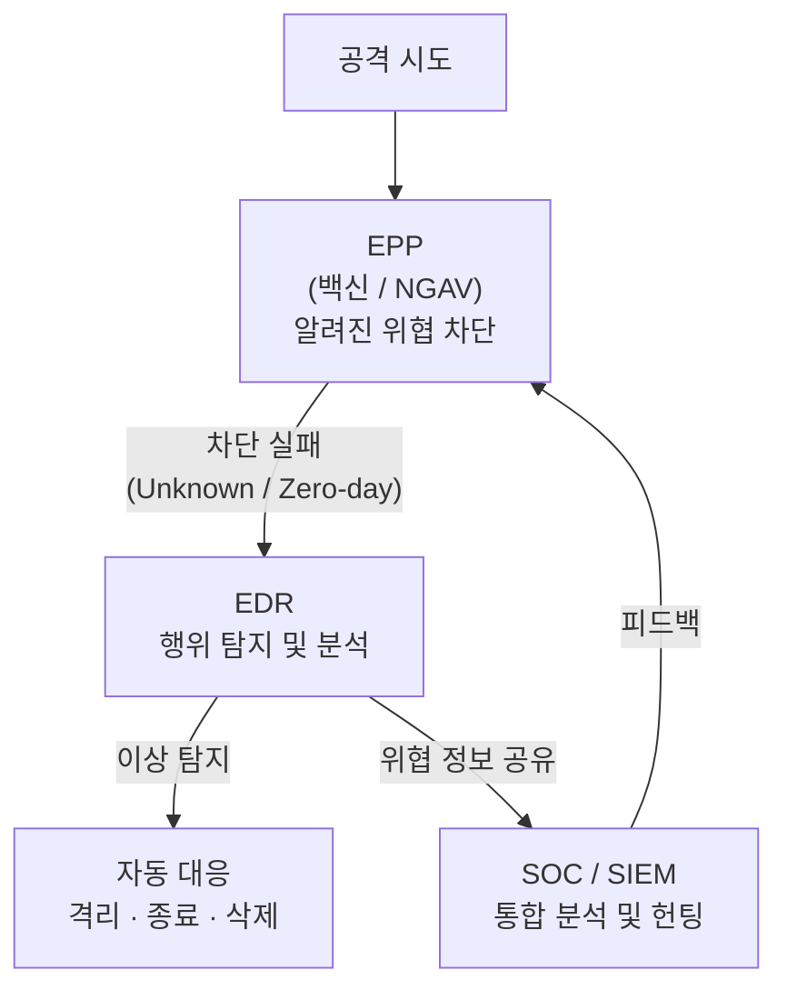

# 엔드포인트 가시성의 핵심, EDR

## I. 행위 분석 기반의 능동적 대응, EDR의 개요

**정의**: 엔드포인트에서 발생하는 프로세스, 파일, 네트워크, 레지스트리 등의 활동을 지속적으로 모니터링하고 기록하여 알려지지 않은 위협을 탐지 및 대응하는 보안 플랫폼  

**주요 목적**:  
( **가시성 확보** ) "**이미 침투했다**"는 가정( **Assume Breach** ) 하에 단말 내 모든 행위의 타임라인 기록  
( **능동적 대응** ) 실시간 위협 탐지 시 즉각적인 단말 격리 및 프로세스 종료를 통한 피해 확산 차단  
( **위협 헌팅** ) **MITRE ATT&CK** 프레임워크 매핑을 통해 잠재적인 공격 흔적을 선제적으로 추적  

---

## II. EDR의 핵심 메커니즘 및 주요 기능

| 기능 요소 | 상세 설명 | 보안적 가치 |
|---------|---------|-----------|
| 지속적 모니터링 | 실시간 이벤트 로그 수집 및 기록 | 공격 전후의 타임라인(Timeline) 분석 가능 |
| 행위 기반 탐지 | 알려지지 않은 위협(Zero-day) 및 이상 행위 탐지 | 시그니처가 없는 변종 악성코드 차단 |
| 위협 헌팅 (Hunting) | MITRE ATT&CK 매핑 등을 통한 잠재 위협 추적 | 선제적 위협 식별 및 보안 사각지대 제거 |
| 사고 대응 (Response) | 네트워크 격리, 프로세스 종료, 파일 삭제 등 | 피해 확산 방지 및 신속한 복구 지원 |

---

## III. EPP(백신)와 EDR의 비교 및 시너지

### 가. EPP vs. EDR 핵심 비교

| 비교 항목 | EPP (Endpoint Protection Platform) | EDR (Endpoint Detection & Response) |
|---------|----------------------------------|-------------------------------------|
| 주요 목적 | 알려진 공격의 차단 (Prevention) | 침투한 위협의 탐지 및 대응 (Detection) |
| 판단 근거 | 파일 패턴 (Signature), 정적 분석 | 동적 행위 (Behavior), 문맥 (Context) 분석 |
| 핵심 질문 | "이 파일은 안전한가?" | "이 프로세스가 왜 이 파일을 수정하는가?" |
| 가시성 | 낮음 (차단 여부 위주) | 매우 높음 (공격 유입 경로 추적) |
| 상호 관계 | 1차 방어막 (필터링) | 2차 가시성/대응 플랫폼 (추적) |

### 나. EPP + EDR 통합 방어 아키텍처

> **핵심:** EPP와 EDR은 경쟁 관계가 아닌 **1차 예방 + 2차 탐지·대응**의 상호 보완적 계층 방어 구조를 형성함
