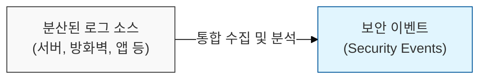
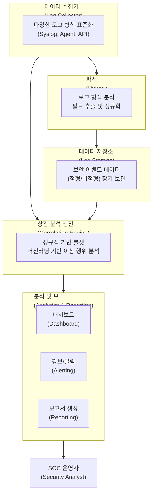

# 위협 탐지 및 분석의 통합 관제탑, SIEM (Security Information and Event Management)

## I. 보안 운영의 핵심, SIEM의 개요

**정의:** 조직 내 다양한 IT 자원(서버, 네트워크 장비, 애플리케이션 등)에서 발생하는 보안 로그 및 이벤트를 실시간으로 수집, 분석, 저장하여 위협을 탐지하고 대응하는 보안 관제 시스템  

**핵심 특징 및 필요성**:  
( **가시성 확보** ) 분산된 로그 데이터를 통합하여 보안 사고 발생 시 전체적인 상황 파악 및 원인 분석 지원  
( **실시간 탐지** ) 알려진 공격 패턴( **Signature** ) 및 비정상 행위( **Anomaly** ) 분석을 통해 위협 실시간 탐지 및 알림 기능 제공  
( **규정 준수** ) 개인정보보호법, ISMS-P 등 각종 컴플라이언스 요구사항 충족을 위한 로그 관리 및 감사 증적 확보  

---

## II. SIEM의 핵심 기능 및 구성 요소

### 가. SIEM 시스템의 주요 구성 요소

### 나. SIEM의 주요 기능 상세

| 기능 영역 | 상세 설명 | 보안적 가치 |
|----------|----------|----------|
| **로그 수집 및 정규화** | 다양한 소스의 로그를 표준화된 형식으로 변환 | 데이터 통합 및 분석 용이성 증대 |
| **이벤트 상관 분석** | 여러 로그에서 발생하는 패턴을 연계하여 복합적인 위협 탐지 | 침해 사고의 초기 징후 및 연관 관계 파악 |
| **실시간 모니터링** | 대시보드를 통한 보안 이벤트 현황 시각화 | 즉각적인 위협 탐지 및 상황 인식 지원 |
| **위협 탐지 및 알림** | 사전 정의된 룰셋 또는 AI 기반으로 의심 행위 탐지 시 즉각 경보 | 침해 사고 발생 시 신속한 초기 대응 가능 |
| **포렌식 분석 및 보고** | 이벤트 로그 저장 및 검색을 통한 사고 원인 분석 및 보고서 생성 | 사고 재발 방지 대책 수립 및 감사 요구 사항 충족 |

---

## III. SIEM 도입 시 고려사항 및 기대 효과

- **도입 고려사항:** 로그 수집 범위, 분석 엔진 성능, 위협 인텔리전스 연동, SOC 운영 인력 및 예산, 클라우드 SIEM vs 온프레미스 SIEM 등
- **기대 효과:** 보안 가시성 향상, 위협 탐지 및 대응 시간 단축, 규정 준수 강화, 전반적인 보안 운영 효율성 증대
