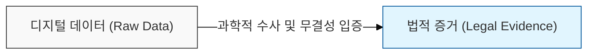
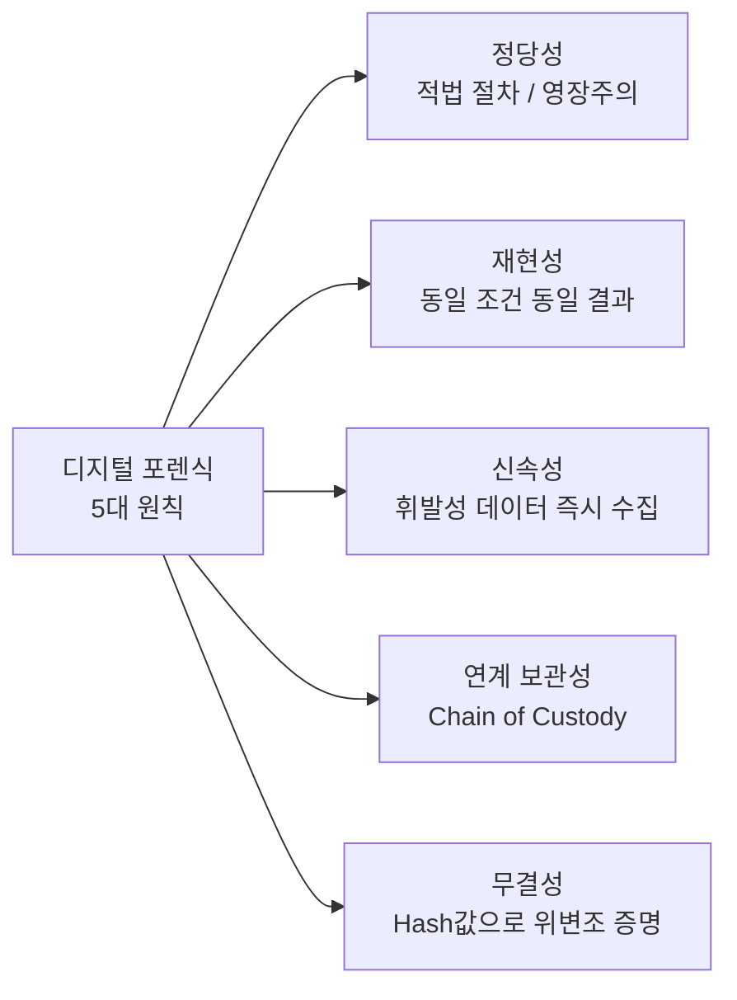

# 디지털 포렌식 (Digital Forensic)

## I. 법적 증거 능력을 갖춘 디지털 증거 확보, 디지털 포렌식의 개요

**정의**: 컴퓨터, 스마트폰, 클라우드 등 디지털 기기에 저장된 전자적 데이터를 수집, 복구, 분석하여 법적 증거로 활용하기 위한 과학적 조사 및 수사 기법  

**핵심 보안 원칙**:  
( **무결성** ) 수집된 증거가 분석 과정에서 위변조되지 않았음을 해시( **Hash** ) 값 등으로 증명  
( **연계 보관성** ) **Chain of Custody**: 증거 수집부터 법정 제출까지의 모든 경로와 담당자 기록 관리  
( **재현성** ) 동일한 도구와 절차로 분석했을 때 동일한 결과가 도출되어야 하는 객관성 확보  
( **적법성** ) 적법 절차 준수 및 영장주의 원칙에 의거하여 증거의 법적 효력( **Admissibility** ) 유지  

---

## II. 디지털 포렌식의 5대 원칙 및 수행 절차

### 가. 증거 효력 유지를 위한 디지털 포렌식 5대 기본 원칙

---

### 나. 디지털 포렌식 수행 5단계 절차

| 단계 | 주요 활동 | 핵심 기술 및 도구 |
|:----:|----------|----------------|
| 1. 증거 준비 | 대응 팀 구성, 장비 점검 | 포렌식 워크스테이션, 차단 백 |
| 2. 증거 수집 | 이미징(Imaging), 복제 | Write Blocker (쓰기 방지 장치), EnCase |
| 3. 증거 이송 | 봉인, 연계 보관성 확보 | 증거물 봉투, 이송 대장 관리 |
| 4. 증거 분석 | 삭제 파일 복구, 타임라인 분석 | 데이터 카빙(Carving), 슬랙 공간 분석 |
| 5. 보고서 작성 | 객관적 사실 기록, 증언 준비 | 분석 결과서, 전문가 소견 |

---

## III. 안티 포렌식(Anti-Forensics) 대응 방안

- **안티 포렌식 유형:** 데이터 암호화, 스테가노그래피(Steganography), 데이터 완전 삭제(Wiping)
- **대응 기술:** 암호 해독(Password Cracking), 메모리 포렌식(Live Response)을 통한 복호화 키 확보
