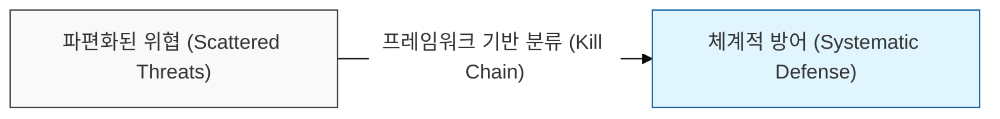
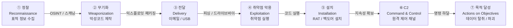
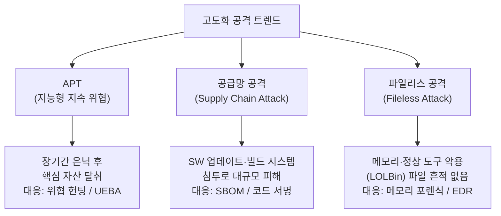

# 정보보안 공격기법의 체계적 분류

## I. 정보보안 공격기법의 정의 및 체계적 분류의 개요

**정의**: 사이버 공격을 단계, 계층, 목적 기준으로 체계화하여 방어 전략 수립과 위협 인텔리전스 활용을 최적화하는 보안 분석 프레임워크  

**도입 필요성**:  
( **위협 가시성** ) 공격자의 전술, 기법, 절차( **TTPs** )를 표준화된 언어로 분류하여 정교한 탐지 규칙 생성 가능  
( **선제적 방어** ) 공격의 연결 고리를 끊는 사이버 킬 체인( **Cyber Kill Chain** ) 기반의 단계별 차단 전략 수립  
( **협업 최적화** ) 위협 정보를 공유하고 사고 대응 프로세스를 표준화하여 보안 운영( **SecOps** )의 효율성 극대화  

---

## II. 사이버 킬 체인(Cyber Kill Chain) 기반 공격 단계 분류

### 가. 킬 체인 단계별 공격 흐름

> **핵심:** 킬 체인의 초기 단계(정찰·전달)를 차단하는 것이 가장 비용 효율적인 방어 전략임

---

### 나. 킬 체인 단계별 공격 기법 및 대응 전략

| 킬 체인 단계 | 주요 공격 기법 | 탐지 / 대응 방법 |
|------------|-------------|----------------|
| 정찰 (Reconnaissance) | OSINT, Shodan 스캐닝, DNS 열거 | 외부 노출 정보 최소화, 허니팟 운영 |
| 무기화 (Weaponization) | 익스플로잇 킷, 매크로 악성코드 제작 | 위협 인텔리전스 기반 IoC 수집 |
| 전달 (Delivery) | 스피어 피싱 이메일, 드라이브바이 다운로드 | 이메일 샌드박스, URL 필터링 |
| 취약점 악용 (Exploitation) | 제로데이, SQL 인젝션, 버퍼 오버플로우 | 패치 관리, WAF, IPS |
| 설치 (Installation) | 루트킷, 웹셸, 레지스트리 지속성 | EDR, 무결성 모니터링 |
| C2 (Command & Control) | HTTP/DNS 터널링, Tor 우회 통신 | 이상 트래픽 탐지, DNS 싱크홀 |
| 목적 달성 (Actions) | 랜섬웨어, 데이터 외부 전송, 파괴 | UEBA, DLP, 백업·복구 |

---

## III. 공격 계층별 기법 분류 및 최신 트렌드

### 가. OSI 계층 및 공격 대상별 분류

| 공격 계층 | 대표 공격 기법 | 목적 | 주요 대응 기술 |
|---------|------------|------|-------------|
| 애플리케이션 계층 | SQL 인젝션, XSS, CSRF, XXE | 데이터 탈취 / 권한 탈취 | WAF, 시큐어 코딩, SAST/DAST |
| 네트워크 계층 | DDoS, IP 스푸핑, MITM, ARP 스푸핑 | 서비스 마비 / 도청 | IDS/IPS, Anti-DDoS, VPN |
| 시스템 계층 | 랜섬웨어, 버퍼 오버플로우, 권한 상승 | 시스템 장악 / 파일 암호화 | EDR, 최소 권한 원칙, ASLR |
| 사회공학 계층 | 피싱, 스미싱, 보이스 피싱, 프리텍스팅 | 자격증명 탈취 / 신뢰 악용 | 보안 인식 교육, MFA 강제 적용 |

---

### 나. 최신 고도화 공격 트렌드

| 공격 유형 | 특징 | 대표 사례 | 핵심 대응 |
|---------|------|---------|---------|
| APT (Advanced Persistent Threat) | 장기 잠복, 표적 집중, 다단계 공격 | Lazarus, APT41 | 위협 헌팅, MITRE ATT&CK 매핑 |
| 공급망 공격 (Supply Chain) | 신뢰된 SW·벤더를 통한 간접 침투 | SolarWinds, XZ Utils | SBOM 관리, 코드 서명 검증 |
| 파일리스 공격 (Fileless) | 정상 프로세스(PowerShell, WMI) 악용 | Cobalt Strike | 행위 기반 탐지, 메모리 분석 |
