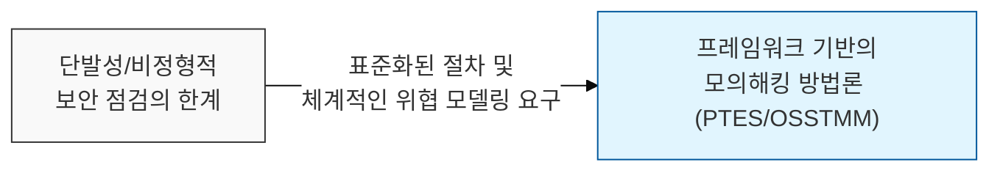
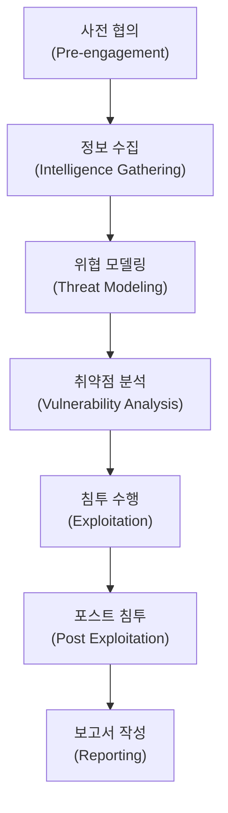

# 체계적인 보안 검증의 표준, 모의해킹 방법론 (Penetration Testing Methodology)

## I. 취약점 식별을 위한 전략적 접근, 모의해킹 방법론의 개요

**정의** : 조직의 정보시스템에 대해 공격자의 관점에서 침투를 시도하여 보안 취약점을 발견하고, 그에 따른 위험을 평가하기 위한 표준화된 절차와 기술적 수행 체계  

**핵심 특징 및 필요성** :  
( **절차적 타당성** ) **PTES**, **OWASP**, **OSSTMM** 등 검증된 프레임워크를 적용하여 진단의 누락을 방지하고 결과의 신뢰성 확보  
( **위험 우선순위화** ) 발견된 취약점이 비즈니스에 미치는 실질적 영향도를 평가하여 가용한 자원의 효율적 배분 지원  
( **규제 준수** ) **ISMS-P**, **PCI-DSS** 등 국내외 주요 보안 인증 및 법적 요구사항 충족을 위한 필수 항목  
( **방어 전략 수립** ) 단순 취약점 나열을 넘어, 침투 시나리오 분석을 통한 심층 방어( **Defense in Depth** ) 체계 고도화  

---

## II. 모의해킹의 표준 수행 단계 (PTES 기준)

### 가. 단계별 수행 프로세스

### 나. 주요 단계별 핵심 활동 내용

| 수행 단계 | 주요 활동 내용 | 핵심 산출물/성과 |
|:---:|--------------|----------------|
| **사전 협의** | 범위(Scope), 일정, 방식, 비상 연락망 확정 | **ROE** (Rules of Engagement) |
| **정보 수집** | **OSINT**, 포트 스캐닝, 서비스 식별 | 타겟 자산 목록 및 네트워크 맵 |
| **위협 모델링** | 공격 벡터 분석 및 최적의 침투 시나리오 설계 | 자산별 위협 시나리오 |
| **취약점 분석** | 자동화 스캔 및 수동 진단을 통한 결함 식별 | 취약점 목록 (확인용) |
| **침투 수행** | 식별된 취약점 악용 및 내부망 진입 시도 | 침투 성공 여부 및 경로 |
| **포스트 침투** | 권한 상승, 측면 이동, 데이터 유출 시뮬레이션 | 비즈니스 영향도 데이터 |
| **보고서 작성** | 발견된 취약점 상세 설명 및 개선 대책 제시 | 최종 결과 보고서 |

---

## III. 테스트 방식별 비교 및 성공 전략

### 가. 지식 수준에 따른 테스트 방식 비교

| 비교 항목 | 블랙박스 (Black Box) | 화이트박스 (White Box) | 그레이박스 (Grey Box) |
|:---:|-------------------|-------------------|-------------------|
| **정보 제공** | 정보 없음 (Zero Knowledge) | 모든 정보 제공 (Full Knowledge) | 일부 정보 제공 (Partial Knowledge) |
| **공격자 관점** | 실제 외부 공격자와 유사 | 내부 조력자/관리자 관점 | 일반 사용자/협력사 관점 |
| **진단 효율성** | 낮음 (탐색 시간 소요) | 높음 (심층 분석 가능) | 보통 |
| **주요 목적** | 외부 방어 경계 검증 | 로직 결함 및 소스 코드 분석 | 권한 오남용 및 내부 위협 점검 |

### 나. 실효성 있는 모의해킹을 위한 성공 전략
- **비즈니스 맥락 이해**: 조직의 핵심 자산과 비즈니스 프로세스를 우선적으로 고려한 시나리오 설계
- **자동화와 수동 진단의 조화**: 도구를 통한 효율적 스캔과 전문가의 창의적인 침투 기법 결합
- **지속적 피드백**: 진단 결과가 일회성으로 끝나지 않도록 조치 이행 점검 및 보안 교육과 연계

> **핵심** : 모의해킹 방법론은 단순한 기술적 행위를 넘어, 조직의 보안 성숙도를 측정하고 실질적인 위협에 대응할 수 있는 **보안 거버넌스**의 핵심 도구로 활용되어야 함
