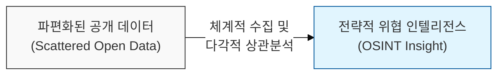
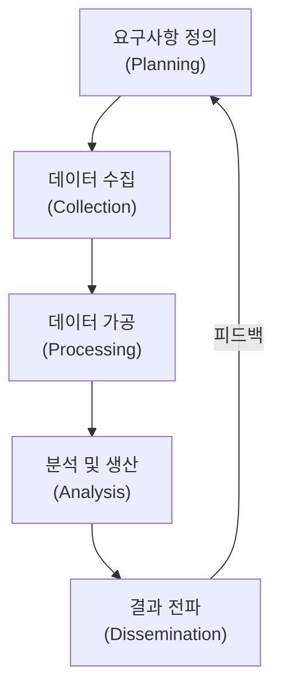

# 공개된 정보 속의 위협 인텔리전스, OSINT (Open Source Intelligence)

## I. 흩어진 데이터의 전략적 가치 창출, OSINT의 개요

**정의** : 합법적으로 수집 가능한 공개된 정보원( **Open Source** )으로부터 데이터를 수집, 분석하여 특정한 목적에 부합하는 유의미한 정보( **Intelligence** )를 도출하는 일련의 활동  

**핵심 특징 및 가치** :  
( **비침해적 수집** ) 대상 시스템에 직접적인 자극을 주지 않고 외부 노출 정보를 수집하므로 탐지될 위험이 낮음  
( **공격 표면 파악** ) 공격자의 시각에서 조직의 외부 노출 자산( **Attack Surface** )을 식별하고 침투 경로를 예측  
( **의사결정 지원** ) 기업 평판 관리, 위협 행위자 추적, 공급망 리스크 관리 등 다각적인 보안 전략 수립에 활용  
( **경제성 및 효율성** ) 고가의 장비 없이도 인터넷상의 방대한 데이터를 활용하여 심층적인 기초 조사가 가능  

---

## II. OSINT의 정보원 및 수행 프로세스

### 가. 5단계 정보 산출 프로세스 (Intelligence Cycle)

### 나. 주요 정보원 및 활용 도구

| 분류 | 주요 정보원 내용 | 대표 활용 도구 |
|:---:|--------------|--------------|
| **검색 엔진** | 고급 검색 연산자를 활용한 민감 파일 탐색 | **Google Dorking**, **Bing** |
| **인프라/IoT** | 도메인, IP, 열린 포트, 취약한 IoT 기기 정보 | **Shodan**, **Censys**, **Whois** |
| **SNS/인물** | 임직원 프로필, 이메일 주소, 기술 스택 언급 | **LinkedIn**, **TheHarvester**, **Hunter.io** |
| **기술 데이터** | 소스 코드 내 키워드, 하드코딩된 API 키 | **GitHub**, **Wayback Machine**, **VirusTotal** |
| **시각화 분석** | 흩어진 정보 간의 관계도 분석 및 가시화 | **Maltego**, **SpiderFoot** |

---

## III. OSINT 활용의 한계 및 보안 대책

### 가. OSINT의 주요 제약 사항 및 고려사항

| 구분 | 주요 내용 | 대응 방안 |
|:---:|----------|----------|
| **정보의 신뢰성** | 가짜 뉴스나 의도적으로 조작된 데이터의 존재 | 다수의 정보원을 통한 교차 검증( **Cross-check** ) |
| **데이터 과부하** | 방대한 양의 데이터 중 유의미한 정보 식별의 어려움 | 자동화 분석 도구 및 필터링 알고리즘 활용 |
| **윤리 및 법률** | 공개 정보라도 개인정보보호법 등 법적 분쟁 소지 | 가이드라인 준수 및 수집 범위의 엄격한 관리 |

### 나. 조직 관점의 OSINT 방어 전략 (Anti-OSINT)
- **외부 노출 자산 최소화**: 불필요한 도메인, 테스트 서버, 개발용 페이지의 외부 노출 차단
- **임직원 보안 인식 제고**: SNS를 통한 업무 관련 정보(기술 스택, 내부 사진 등) 유출 방지 교육
- **디지털 풋프린트 관리**: 주기적인 조직 관련 키워드 모니터링 및 노출된 민감 데이터의 즉각적인 삭제 요청

> **핵심** : **OSINT**는 정보의 양보다 '분석의 질'이 핵심이며, 이를 통해 식별된 취약 요소들을 선제적으로 관리하는 것이 현대적 **공격 표면 관리(ASM)**의 시작점임
