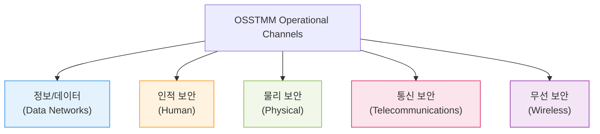

# 정량적 보안 분석의 글로벌 표준, OSSTMM (Open Source Security Testing Methodology Manual)

## I. 과학적 측정 기반의 보안 검증 체계, OSSTMM의 개요

**정의** : **ISECOM**(Institute for Security and Open Methodologies)에서 개발한 보안 테스트 표준으로, 보안 제어의 유효성을 과학적이고 정량적으로 측정하여 보안 성숙도를 평가하는 방법론  

**핵심 특징 및 가치** :  
( **정량적 지표 제공** ) **RAV**(Risk Assessment Value)라는 수치를 통해 보안 수준을 객관적으로 계량화하여 경영진의 의사결정 지원  
( **과학적 방법론** ) 테스트 대상을 5가지 운영 채널( **Channels** )로 구분하고, 각 채널에 대해 일관된 검증 프로세스 적용  
( **포괄적 범위** ) 단순 기술 점검을 넘어 인적( **Human** ), 물리적( **Physical** ), 무선( **Wireless** ) 보안을 모두 아우르는 통합 진단 수행  
( **오픈 소스 표준** ) 전 세계 전문가들에 의해 지속적으로 업데이트되는 투명한 표준으로, 글로벌 보안 신뢰성 확보 가능  

---

## II. OSSTMM의 5대 운영 채널 및 분석 매커니즘

### 가. 보안 테스트를 위한 5대 핵심 채널 (Operational Channels)

### 나. 주요 분석 지표 및 프로세스 특징

| 핵심 개념 | 상세 설명 | 보안적 가치 |
|:---:|----------|----------|
| **RAV** | **Risk Assessment Value** (위험 평가 지표) | 보안 통제의 실제 효성( **Security Actual** )을 0~100 사이의 수치로 산출 |
| **Porosity** | 시스템 내부로 침투할 수 있는 취약성(다공성) | 외부 노출 정도 및 공격 가능성 측정 |
| **Separation** | 보안 제어 간의 분리 및 독립성 수준 | 심층 방어( **Defense in Depth** )의 유효성 검증 |
| **Limitations** | 보안 시스템이 가진 내재적 한계점 | 잔무 위험( **Residual Risk** ) 파악 및 대응 전략 수립 |

---

## III. OSSTMM vs. PTES 비교 및 활용 전략

### 가. 주요 보안 방법론 비교

| 비교 항목 | PTES (Execution Standard) | OSSTMM (Methodology Manual) |
|:---:|--------------------------|----------------------------|
| **주요 목표** | 모의해킹의 **수행 단계 표준화** | 보안 통제의 **과학적/정량적 측정** |
| **결과물 형태** | 기술적 취약점 보고서 중심 | **RAV** 지표 기반의 통계 보고서 |
| **평가 관점** | 침투 성공 여부(공격자 관점) | 보안 통제 가동 효율성(방어자 관점) |
| **강점** | 구체적인 해킹 기술 가이드라인 | 경영진 보고용 정량적 수치 제공 |

### 나. 효과적인 OSSTMM 활용을 위한 제언
- **RAV 지표의 비즈니스 연계**: 보안 예산 투자 대비 성과( **ROI** )를 증명하기 위한 지표로 **RAV**를 적극 활용
- **채널 통합 진단**: IT 인프라 점검 시 인적 보안(사회 공학)과 물리 보안을 병행하여 전방위적인 보안 가시성 확보
- **규제 준수 대응**: 보안 성숙도 측정이 필요한 국내외 인증( **ISMS-P**, **ISO 27001** 등) 시 객관적 근거 자료로 활용

> **핵심** : **OSSTMM**은 보안을 "느끼는 것"이 아니라 "측정하는 것"으로 전환시킨 표준이며, 정량화된 데이터를 통해 조직의 실질적인 보안 성숙도를 견인하는 강력한 도구임
