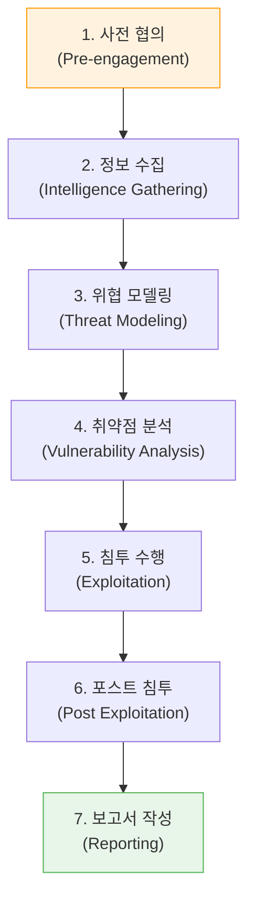

# 모의해킹 수행의 글로벌 표준, PTES (Penetration Testing Execution Standard)

## I. 모의해킹 품질의 상향 평준화, PTES의 개요

**정의** : 모의해킹의 전 과정(사전 협의부터 보고서 작성까지)에 대해 일관된 품질과 체계적인 결과를 보장하기 위해 정의된 7단계의 기술적 수행 표준  

**핵심 가치 및 지향점** :  
( **수행 표준화** ) 진단자의 주관적 판단에 따른 품질 편차를 최소화하고, 모든 진단 영역에 대한 철저한 검증 보장  
( **기술적 깊이** ) 단순 절차 나열이 아닌, 각 단계에서 수행해야 할 구체적인 기술적 가이드라인( **Technical Guideline** ) 제시  
( **비즈니스 정렬** ) 위협 모델링을 통해 조직의 비즈니스 리스크와 직결된 실질적인 취약점 발굴에 집중  
( **투명성 확보** ) 고객과 진단자 간의 명확한 **ROE**(Rules of Engagement) 설정을 통해 법적/운영적 리스크 방지  

---

## II. PTES의 7단계 핵심 수행 체계

### 가. 단계별 목적 및 연계 구조

### 나. 단계별 상세 활동 및 주요 검토 항목

| 단계 | 주요 활동 (Activities) | 핵심 검토 항목 (Key Checks) |
|:---:|----------------------|--------------------------|
| **1. 사전 협의** | 범위(Scope) 정의, 도구 선정, 시간 계획 수립 | **ROE** 확정, 비상 연락망, 화이트리스트 IP |
| **2. 정보 수집** | **OSINT**, 소셜 엔지니어링 준비, 풋프린팅 | 도메인, IP 대역, 임직원 정보, 사용 기술 스택 |
| **3. 위협 모델링** | 자산 식별, 공격자 관점의 공격 벡터 설계 | 비즈니스 로직 취약점 시나리오, 위협 우선순위 |
| **4. 취약점 분석** | 자동화 스캔, 수동 취약점 식별, 설정 오류 점검 | 미패치 취약점, 디폴트 계정, 권한 설정 미흡 |
| **5. 침투 수행** | 익스플로잇 실행, 방어 기재 우회, 내부망 진입 | 서비스 가용성 영향 최소화, 침투 성공 증적 |
| **6. 포스트 침투** | 권한 상승(Privilege Escalation), 측면 이동 | 데이터 유출 경로 확인, 영속성 확보(Backdoor) |
| **7. 보고서 작성** | 기술적 취약점 및 비즈니스 위험도 요약 | 조치 가이드(Remediation), 위험 등급(CVSS) |

---

## III. PTES의 실무적 활용 및 타 표준과의 관계

### 가. PTES와 타 보안 프레임워크 비교

| 구분 | PTES | OSSTMM | NIST SP 800-115 |
|:---:|------|--------|----------------|
| **핵심 성격** | 모의해킹 **수행 절차** 중심 | 보안 테스트의 **운영 지표** 중심 | 정부/기관용 **기술 점검 가이드** |
| **강점** | 구체적인 기술 가이드라인 제공 | 정량적 측정( **RAV** ) 가능 | 체계적이고 보수적인 접근 방식 |
| **적용 권장** | 상용 서비스/기업 모의해킹 | 보안 성숙도 측정 및 정량화 | 공공기관 및 규제 준수 대상 |

### 나. 성공적인 PTES 적용을 위한 제언
- **기술 가이드라인 활용**: PTES 공식 웹사이트에서 제공하는 방대한 기술 가이드라인을 참조하여 진단 도구 및 스크립트 최적화
- **위협 모델링 강화**: 단순히 알려진 취약점을 찾는 것을 넘어, 타겟 조직의 특화된 위협(예: 금융권의 이상 거래 등)을 반영한 모델링 수행
- **포스트 침투의 중요성**: 침투 성공 이후의 시나리오(데이터 탈취 경로 등)를 통해 보안 사고 발생 시의 실질적 피해 규모 가시화

> **핵심** : **PTES**는 모의해킹을 단순한 '점검'에서 '전략적 보안 검증'으로 격상시킨 표준이며, 진단자와 고객 모두에게 명확한 기준과 고품질의 결과물을 보장함
