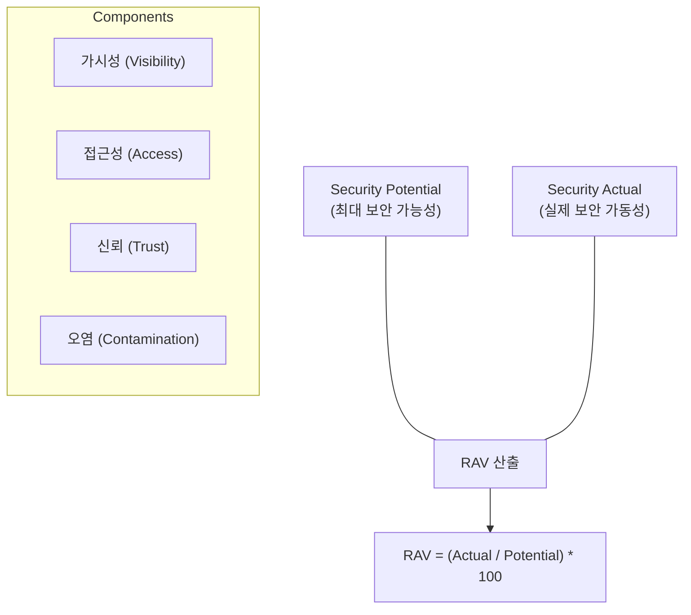

# 보안 성숙도의 과학적 지표, RAV (Risk Assessment Value)

## I. 보안 가동 효율성의 정량적 측정, RAV의 개요

**정의** : **OSSTMM** 방법론에서 사용되는 정량적 보안 측정 지표로, 특정 운영 채널 내 보안 제어( **Controls** )의 실제 유효성을 수학적으로 산출하여 0~100 사이의 수치로 표현한 값  

**핵심 특징 및 가치** :  
( **객관성 확보** ) 진단자의 주관적 판단을 배제하고, 수학적 공식에 기반하여 보안 성숙도를 측정하므로 결과의 신뢰성 극대화  
( **의사결정 최적화** ) 보안 투자 대비 성과( **ROI** )를 수치로 증명 가능하며, 우선적으로 보완이 필요한 영역을 명확히 식별  
( **상호 비교 가능** ) 동일한 공식을 적용하여 지점별, 시점별 보안 수준을 비교 분석하고 장기적인 보안 추세( **Trend** ) 관리 가능  
( **통합적 관점** ) 기술적 취약점뿐만 아니라 가시성, 접근성, 신뢰 등 보안 운영의 핵심 요소를 통합적으로 반영  

---

## II. RAV의 산출 메커니즘 및 구성 요소

### 가. RAV 산출 공식 및 원리

### 나. RAV를 결정하는 5대 핵심 지표 (Metrics)

| 지표 항목 | 상세 설명 | 산출 영향 |
|:---:|----------|----------|
| **가시성 (Visibility)** | 외부에서 대상 시스템의 정보를 얼마나 식별할 수 있는가 (정보 노출도) | 낮을수록 보안성 향상 |
| **접근성 (Access)** | 대상 시스템에 접근할 수 있는 경로 및 접점이 얼마나 존재하는가 | 낮을수록 보안성 향상 |
| **신뢰 (Trust)** | 시스템 간, 사용자 간 설정된 신뢰 관계의 복잡도 및 범위 | 낮을수록(최소 권한) 보안성 향상 |
| **오염 (Contamination)** | 비정상적인 데이터나 코드가 주입될 수 있는 경로의 존재 여부 | 낮을수록 보안성 향상 |
| **다공성 (Porosity)** | 보안 제어를 우회하거나 통과할 수 있는 미세한 틈새의 정도 | 낮을수록 보안성 향상 |

---

## III. RAV의 실무적 활용 및 위험 지표(CVSS)와의 비교

### 가. RAV vs. CVSS (Common Vulnerability Scoring System)

| 비교 항목 | CVSS (위험 점수) | RAV (보안 지표) |
|:---:|----------------|----------------|
| **분석 대상** | 개별 **취약점** (Vulnerability) | 보안 **통제/채널** (Control/Channel) |
| **측정 관점** | 취약점의 파괴력 및 악용 용이성 | 보안 시스템의 실제 가동 효율성 |
| **주요 용도** | 패치 우선순위 결정 | 전반적인 보안 성숙도 및 ROI 측정 |
| **수치 해석** | 점수가 높을수록 위험함 (0~10) | 점수가 높을수록 안전함 (0~100) |

### 나. RAV 지표를 활용한 보안 거버넌스 강화 전략
- **보안 가시성 대시보드 구축**: 각 채널(네트워크, 인적, 물리 등)별 **RAV** 지표를 가시화하여 통합 보안 관제에 활용
- **취약점 조치 가이드라인**: 단순 패치 권고를 넘어, **RAV** 점수를 하락시키는 근본 원인(가시성 과다 노출 등)에 대한 아키텍처 개선 제언
- **정기 보안 감사 표준화**: 연간/분기별 **RAV** 측정 데이터를 기반으로 조직의 보안 성숙도 변화를 정량적으로 보고

> **핵심** : **RAV**는 보안을 추상적인 개념에서 "측정 가능한 데이터"로 전환시킨 혁신적인 지표이며, 이를 통해 조직은 보다 과학적이고 근거 중심적인 보안 체계를 구축할 수 있음
