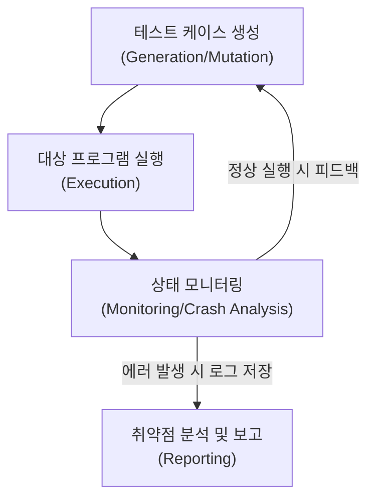

# 미지의 취약점을 찾는 자동화된 테스트, 퍼징 (Fuzzing)

## I. 예측 불가능한 입력값을 통한 보안 결함 탐지, 퍼징의 개요

**정의** : 대상 소프트웨어에 무작위이거나 변형된 비정상적인 입력값( **Fuzz** )을 지속적으로 주입하고, 그 과정에서 발생하는 예외 상황( **Crash** )을 모니터링하여 보안 취약점을 발견하는 자동화된 소프트웨어 테스트 기법  

**핵심 특징 및 가치** :  
( **자동화된 탐지** ) 수동 분석으로 찾기 힘든 논리적 오류나 메모리 결함을 대량의 테스트 케이스를 통해 자동으로 식별  
( **제로데이 대응** ) 알려지지 않은 취약점( **Zero-day** )을 사전에 발견하여 공격자에 의한 악용 가능성을 차단  
( **확장성** ) 프로토콜, 파일 포맷, API 등 다양한 인터페이스를 대상으로 유연하게 적용 가능  
( **코드 커버리지** ) 테스트가 진행됨에 따라 코드의 실행 경로를 분석하여 테스트의 효율성과 정확도를 향상( **Feedback-driven** )  

---

## II. 퍼징의 수행 메커니즘 및 주요 분류

### 가. 퍼징의 일반적인 수행 프로세스

### 나. 정보 수준 및 생성 방식에 따른 주요 분류

| 분류 기준 | 유형 | 상세 설명 |
|:---:|--------------|--------------|
| **정보 수준** | **Black-box** | 소스 코드 정보 없이 입력/출력만 확인 (빠른 속도, 낮은 정확도) |
| (Knowledge) | **Grey-box** | 프로그램 내부 구조(커버리지 등)를 일부 활용 ( **AFL**, **LibFuzzer** 등) |
| | **White-box** | 소스 코드 전체 분석 및 심볼릭 실행 활용 (높은 정확도, 느린 속도) |
| **생성 방식** | **Generation** | 데이터 포맷 규칙에 맞춰 처음부터 생성 (유효한 입력값 확률 높음) |
| (Input) | **Mutation** | 기존 정상 입력값을 미세하게 변형 (구현이 쉬움, 예측 불가성 높음) |

---

## III. 퍼징 vs. 기존 분석 기법 비교 및 고려사항

### 가. 정적/동적 분석과의 비교

| 비교 항목 | 정적 분석 (Static Analysis) | 동적 분석 (Dynamic Analysis) | 퍼징 (Fuzzing) |
|:---:|---------------------------|----------------------------|---------------|
| **분석 방식** | 소스 코드/바이너리 단순 스캔 | 프로그램 실행 중 상태 분석 | 비정상 입력 주입 및 반응 모니터링 |
| **핵심 장점** | 전체 코드 커버리지 확보 용이 | 실제 실행 환경의 문맥 파악 | 자동화된 대량 테스트, 미지 결함 발견 |
| **핵심 단점** | 높은 오탐( **False Positive** ) 발생 | 분석 시나리오에 한정된 결과 | 하드웨어 자원 소모, 분석 대상 종속성 |
| **주요 도구** | **Fortify**, **SonarQube** | **GDB**, **OllyDbg** | **AFL**, **Peach Fuzzer**, **OSS-Fuzz** |

### 나. 성공적인 퍼징을 위한 기술적 고려사항
- **에지 케이스(Edge Case) 설계**: 경계값이나 특수 문자를 효과적으로 포함하여 유의미한 크래시 유도
- **지능형 피드백 루프**: 코드 커버리지( **Code Coverage** ) 지표를 활용하여 새로운 경로를 실행하는 입력값을 우선적으로 학습
- **오류 분석 자동화**: 발생한 크래시가 실제 보안 취약점( **Exploitable** )인지 자동으로 판별하는 기술 연계

> **핵심** : 퍼징은 소프트웨어의 견고함을 검증하는 강력한 자동화 도구이며, **시큐어 코딩**과 병행하여 **SDLC**(Software Development Life Cycle) 전반에 걸쳐 지속적으로 수행되어야 함
