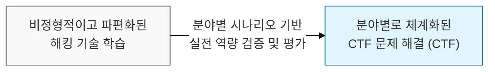
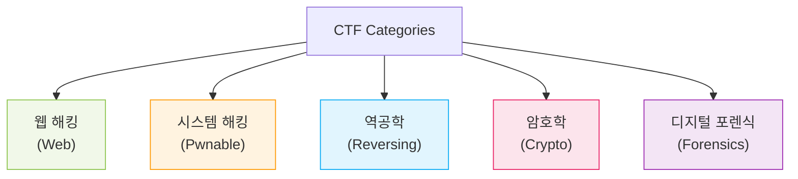

# 실전 보안 기술의 경연, CTF 문제 유형 및 분류 (CTF Categories)

## I. 체계적인 해킹 역량 검증의 장, CTF의 개요

**정의** : **CTF**(Capture The Flag)는 정보 보안 분야의 문제를 해결하여 숨겨진 문자열인 플래그( **Flag** )를 찾아 점수를 획득하는 해킹 방어 대회로, 다양한 영역의 보안 기술을 종합적으로 평가하는 경연  

**핵심 특징 및 가치** :  
( **실전 기술 배양** ) 최신 취약점과 공격 기법이 반영된 문제를 통해 이론을 넘어선 실질적인 익스플로잇( **Exploit** ) 역량 강화  
( **문제 해결 능력** ) 제한된 시간 내에 복잡한 로직을 분석하고 우회 경로를 찾아내는 창의적 사고력( **Thinking out of box** ) 배양  
( **팀워크 및 협업** ) 팀 단위 경쟁을 통해 각 분야의 전문가들이 협력하여 대규모 문제를 해결하는 프로세스 경험  
( **보안 인재 발굴** ) 객관적인 점수 지표를 통해 검증된 실력을 갖춘 화이트해커 인력 양성 및 평가의 척도로 활용  

---

## II. CTF의 주요 문제 분야별 상세 특징

### 가. 5대 핵심 카테고리 분류

### 나. 카테고리별 주요 공격 포인트 및 핵심 기술

| 카테고리 | 주요 공격 대상 및 내용 | 핵심 기술 / 취약점 |
|:---:|----------------------|------------------|
| **Web** | 웹 애플리케이션 및 서버 취약점 분석 | **SQLi**, **XSS**, **LFI/RFI**, **SSRF**, **Deserialization** |
| **Pwnable** | 실행 파일(바이너리)의 메모리 결함 공격 | **Buffer Overflow**, **FSB**, **ROP**, **Heap Exploit** |
| **Reversing** | 컴파일된 프로그램의 로직 분석 및 우회 | **Static/Dynamic Analysis**, **Anti-Debugging**, **Packing** |
| **Crypto** | 암호 알고리즘의 결함 탐지 및 평문 복구 | **RSA/AES Attack**, **Hash Collision**, **Padding Oracle** |
| **Forensics** | 파일, 네트워크 패킷, 메모리 등 흔적 추적 | **File Carving**, **PCAP Analysis**, **Memory Forensics** |
| **Misc** | 프로그래밍, 상식, 퍼즐 등 기타 영역 | **Python Scripting**, **Steganography**, **PPC** |

---

## III. CTF 운영 방식 비교 및 전략적 접근

### 가. Jeopardy vs. Attack-Defense 방식 비교

| 비교 항목 | 문제 풀이 방식 (Jeopardy) | 공격 방어 방식 (Attack-Defense) |
|:---:|-------------------------|-------------------------------|
| **수행 방식** | 준비된 문제를 풀고 플래그 획득 | 자신의 서버 방어와 타 팀 서버 공격 병행 |
| **핵심 역량** | 특정 분야의 심층적인 분석 능력 | 실시간 패치( **Patching** ) 및 자동화 공격 |
| **대회 규모** | 대규모 인원 참가 가능 (온라인 위주) | 소규모 선발 팀 대상 (오프라인 위주) |
| **현장감** | 개인/팀별 문제 해결에 집중 | 실시간 공격 트래픽 분석 및 대응의 긴박함 |

### 나. CTF 우승을 위한 전략적 제언
- **분야별 협업 체계**: 팀원 간 강점 분야를 나누어 문제 풀이 속도와 정확도를 극대화
- **자동화 도구 개발**: 반복적인 스캐닝이나 단순 익스플로잇은 파이썬( **Pwntools** 등)을 통해 자동화
- **최신 트렌드 팔로우**: **CTFtime** 등을 통해 글로벌 대회의 최신 문제 경향과 라이트업( **Write-up** )을 상시 분석

> **핵심** : **CTF**는 정보 보안의 전 영역을 아우르는 최고의 실전 훈련장이며, 여기서 습득한 기술적 통찰은 실제 인프라의 취약점을 선제적으로 방어하는 핵심 역량으로 직결됨
