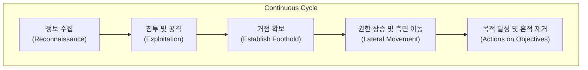

# 실전적 공격 시뮬레이션의 정수, 레드팀 (Red Teaming)

## I. 실전 대응력 강화를 위한 공격자 관점의 시뮬레이션, 레드팀의 개요

**정의** : 조직의 보안 방어 체계( **Blue Team** )의 유효성을 검증하기 위해, 실제 공격자의 전략, 기술, 절차( **TTPs** )를 모방하여 예고 없이 실전과 유사한 공격을 수행하는 전문 그룹 또는 활동  

**핵심 특징 및 가치** :  
( **공격자 관점** ) 내부 가이드라인이 아닌 실제 해커의 시각에서 보안 허점을 탐색하고 침투 경로를 확보  
( **실전성 보장** ) 사전 공지 없이 수행되어 탐지 시스템뿐만 아니라 인적 대응 조직의 대응 역량을 실질적으로 평가  
( **종합적 평가** ) 네트워크, 시스템뿐만 아니라 물리 보안, 사회 공학적 기법을 아우르는 전방위적인 위협 시나리오 적용  
( **방어 체계 고도화** ) 공격 성공 사례를 분석하여 블루팀의 탐지 및 대응 프로세스를 강화하는 **Purple Teaming**의 기반 제공  

---

## II. 레드팀의 수행 메커니즘 및 주요 프로세스

### 가. 레드팀의 단계별 공격 프로세스

### 나. 레드팀의 주요 전략 및 기술 (TTPs)

| 단계 | 주요 활동 내용 | 핵심 기술 예시 |
|:---:|--------------|--------------|
| **Recon** | 타겟 조직의 인프라, 임직원 정보, 보안 장비 조사 | **OSINT**, 소셜 미디어 분석, 네트워크 스캐닝 |
| **Delivery** | 악성 코드나 피싱 페이지를 타겟에게 전달 | 스피어 피싱( **Spear Phishing** ), **USB** 투척 |
| **Exploit** | 취약점을 이용하거나 속여서 내부망 진입 | **Zero-day**, 알려진 취약점, 사회 공학적 기법 |
| **Control** | 감염된 시스템을 외부에서 제어 ( **C&C** ) | 은닉 통신 채널( **DNS Tunneling** ), 비정상 포트 통신 |
| **Movement** | 내부망에서 다른 중요 서버로 이동하며 권한 획득 | **Pass-the-Hash**, **Kerberoasting**, **AD** 공격 |

---

## III. 레드팀 vs. 모의해킹 (Penetration Testing) 비교

### 가. 레드팀과 모의해킹의 핵심 차이점

| 비교 항목 | 모의해킹 (Penetration Testing) | 레드팀 (Red Teaming) |
|:---:|------------------------------|----------------------|
| **핵심 목적** | 취약점의 식별 및 나열 (전수 조사) | 특정 목적 달성 및 방어 체계 검증 (실전성) |
| **범위 (Scope)** | 특정 시스템, 웹, 앱 등 제한적 범위 | 전사 인프라, 물리, 사람 등 무제한적 범위 |
| **방법론** | 정해진 시나리오와 일정 준수 | 실제 공격자와 동일한 비정형적 기법 사용 |
| **통보 여부** | 사전에 관리팀과 합의 및 통보 | 불시에 수행 (블루팀은 인지하지 못함) |
| **결과물** | 취약점 리스트 및 패치 가이드 | 공격 시나리오별 대응 유효성 분석 보고서 |

### 나. 향후 발전 방향: 퍼플팀 (Purple Teaming)
- **개념**: 레드팀(공격)과 블루팀(방어)이 단절되지 않고, 공격 데이터를 실시간으로 공유하여 탐지 룰을 개선하고 대응 자동화를 이끌어내는 협업 모델
- **효과**: 공격 기법에 대한 깊은 이해를 바탕으로 실질적인 방어 가시성( **Visibility** ) 확보 및 보안 운영 효율 극대화

> **핵심** : 레드팀은 단순히 "뚫는 것"이 목적이 아니라, "공격자의 눈"으로 조직의 취약점을 조기에 발견하여 실질적인 **회복력(Resilience)**을 갖추게 하는 전략적 보안 활동임
