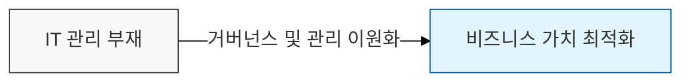

# COBIT 기반 보안 관리 체계

## I. 비즈니스 가치 중심의 보안 통제, COBIT 보안 관리의 정의

**핵심 가치**:  
 (**거버넌스 체계화**) 보안 활동을 거버넌스(Governance)와 관리(Management)로 명확히 분리하여 통제  
 (**비즈니스 연계**) 보안 위험을 비즈니스 관점에서 평가하여 기업의 목표 달성과 보안 투자를 정렬  
 (**최적화된 리스크 관리**) 프레임워크 기반의 정밀한 진단을 통해 보안 리스크를 수용 가능한 수준으로 관리  

---

## II. COBIT 기반 보안 관리 체계의 구조 및 메커니즘

### 가. 보안 거버넌스와 관리의 계층 구조

- **Governance**(EDM): 이사회가 주도하며 보안 전략을 평가(Evaluate)하고, 방향을 지시(Direct)하며, 성과를 모니터링(Monitor)함
- **Management**(PBRM): 경영진이 주도하며 보안 계획(Plan), 구축(Build), 운영(Run), 감시(Monitor) 단계를 수행함

### 나. 보안 관련 핵심 도메인 및 활동

| 도메인 영역 | 주요 보안 관리 활동 | 기술사 핵심 키워드 |
|:---:|------------------|-----------------|
| **EDM03** | 보안 위험 보장 및 최적화 | 위험 수용 수준 (Risk Appetite) |
| **APO12** | 보안 리스크 관리 프로세스 수립 | IT 리스크 프로파일링 |
| **APO13** | 정보보호 관리 체계(ISMS) 운영 | 보안 정책 및 가이드라인 |
| **BAI06** | 보안 변경 및 형상 관리 | 안전한 배포 (Secure Release) |
| **DSS05** | 운영 보안 서비스 및 침해사고 대응 | 취약점 관리, 계정 및 권한 제어 |
| **MEA02** | 보안 통제 시스템의 시스템적 감시 | 내부 통제 및 규제 준수(Compliance) |

---

## III. COBIT 기반 보안 체계 도입 시 고려사항 및 기대효과

### 가. 도입 시 고려사항 (Tailoring)

- **Design Factors**: 기업의 규모, 보안 위협 수준, 컴플라이언스 요구사항에 맞게 통제 항목을 최적화(Tailoring)해야 함
- **Focus Areas**: 사이버 보안, 클라우드 컴퓨팅 등 특정 영역에 집중된 보안 설계 필요

### 나. 기대효과 (Expected Benefits)

- **비즈니스 정렬**: 보안 투자가 비즈니스 가치 창출에 기여함을 입증 (Strategic Alignment)
- **책임성 명확화**: **RACI** 차트(실행 / 책임 / 자문 / 고지)를 통한 보안 역할과 책임의 명확한 정의
- **리스크 가시성**: 전사적 리스크 대시보드를 통해 실시간 보안 상태 파악 및 신속한 의사결정
