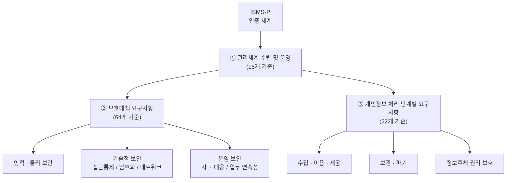

# ISMS-P (Personal Information & Information Security Management System)

## I. 정보보호와 개인정보보호의 통합 관리 체계, ISMS-P의 개요

**정의:** 정보보호(ISMS)와 개인정보보호(PIMS) 관리체계를 통합하여, 기업이 스스로 보안 위협에 대응할 수 있도록 마련된 국내 최고 수준의 종합 인증제도

**통합 배경:** 인증 중복성 해소, 기업 부담 경감, 개인정보 보호 강화 및 관리 효율성 제고

---

## II. ISMS-P의 인증 체계 및 주요 인증 기준

### 가. ISMS-P 인증 체계도 (Certification Framework)

> **핵심:** 관리체계의 수립·운영을 기반으로 정보보호 및 개인정보 보호 대책이 유기적으로 연계됨

---

### 나. 영역별 주요 인증 기준 및 세부 내용

| 인증 영역 | 인증 기준 수 | 주요 내용 및 핵심 항목 |
|-----------|:-----------:|----------------------|
| 1. 관리체계 수립 및 운영 | 16개 | 관리체계 설정, 위험 관리, PDCA(Plan-Do-Check-Act) 사이클 운영 |
| 2. 보호대책 요구사항 | 64개 | 인적 보안, 물리 보안, 네트워크 보안, 시스템 접근 통제, 사고 대응 |
| 3. 개인정보 처리 단계별 요구사항 | 22개 | 수집, 이용/제공, 파기 시 정보주체의 권리 보호 및 법적 준거성 확보 |

---

## III. ISMS-P 인증의 기대효과 및 향후 발전 방향

- **기대효과:** 기업의 보안 거버넌스 확립, 법적 컴플라이언스 준수, 대외 신인도 향상 및 리스크 감소
- **발전 방향:** 최근 클라우드 서비스 확산에 따른 **CSAP**(클라우드 보안인증)와의 연계 및 글로벌 보안 표준(ISO 27001)과의 상호 운용성 강화 필요
