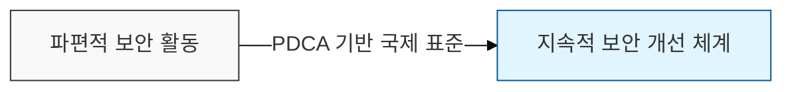

# 정보보호 관리체계 국제 표준 (ISO 27001)

## I. 지속적 보안 개선을 위한 ISO 27001의 정의

**핵심 가치**:  
 (**보안 3대 요소 확보**) 정보자산의 기밀성, 무결성, 가용성(CIA) 유지를 위한 체계적인 관리 프로세스  
 (**지속적 개선**) PDCA(Plan-Do-Check-Act) 모델을 통한 정보보호 관리 체계의 상시 고도화  
 (**글로벌 신뢰성**) 국제 표준 인증을 통해 대외 보안 신뢰도를 높이고 비즈니스 경쟁력 강화  

---

## II. ISO 27001:2022의 주요 구성 및 통제 항목

### 가. ISO 27001 운영 체계 (PDCA Cycle)

- **Plan**: 범위 설정, 보안 방침 수립, 위험 평가 및 처리 계획
- **Do**: 보안 통제 항목 적용 및 운영
- **Check**: 내부 감사, 경영진 검토, 성과 측정
- **Act**: 부적합 사항에 대한 시정 조치 및 지속적 개선

### 나. Annex A의 4개 통제 영역 (ISO 27001:2022 개정 기준)

2022년 개정을 통해 기존 14개 도메인이 4개 테마로 통합·재편되었습니다.

| 통제 영역 (Themes) | 통제 항목 수 | 주요 내용 |
|:---:|:---:|-----------|
| 1. **조직적 통제** (Organizational) | 37개 | 보안 정책, 자산 관리, 클라우드 서비스 이용 보안 |
| 2. **인적 통제** (People) | 8개 | 채용 전 / 중 / 후 보안, 원격 근무 보안 |
| 3. **물리적 통제** (Physical) | 14개 | 출입 통제, 설비 보안, 장치 보안 유지 |
| 4. **기술적 통제** (Technological) | 34개 | 인증, 암호화, 네트워크 보안, 보안 코딩 |

---

## III. ISO 27001과 국내 ISMS-P의 비교

| 비교 항목 | ISO 27001 (국제 표준) | ISMS-P (국내 표준) |
|----------|----------------------|-------------------|
| **인증 주체** | ISO (국제표준화기구) | KISA (한국인터넷진흥원) |
| **법적 구속력** | 자율 인증 (글로벌 신뢰 확보용) | 의무 인증 (일정 규모 이상 기업 대상) |
| **인증 범위** | 전 산업 분야 (글로벌 통용) | 국내 사업자 (ICT 서비스 위주) |
| **주요 차이** | 거버넌스 및 프레임워크 중심 | 개인정보 보호(Privacy) 항목 강화 |
| **통제 항목** | 93개 항목 (2022 버전 기준) | 102개 항목 (관리 16, 보호 64, 개인정보 22) |
