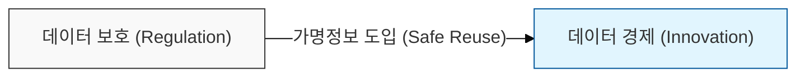
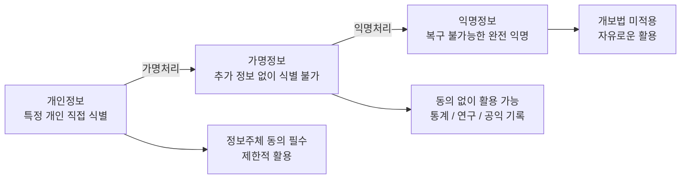
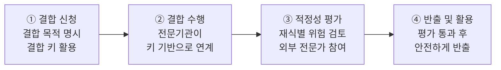

# 데이터 3법: 가명정보와 익명정보 및 결합 절차

## I. 데이터 활용의 법적 근거, 데이터 3법의 개요

**정의**: 개인정보 보호법, 정보통신망법, 신용정보법의 개정을 통해 개인정보의 가명처리와 활용 범위를 명확히 규정하고 체계를 일원화한 법률 체계  

**도입 배경 및 핵심 가치**:  
( **규제 일원화** ) 부처별로 산재했던 개인정보 관련 법률을 통합하여 집행 체계의 혼선 방지 및 효율성 제고  
( **데이터 활용** ) 통계작성, 과학적 연구 등 공익적 목적으로 정보주체 동의 없이 가명정보를 활용할 수 있는 법적 근거 마련  
( **신뢰 확보** ) 재식별 금지 등 기술적·관리적 안전성 확보 조치를 의무화하여 정보주체의 권익 보호와 산업 혁신의 균형 도모  

---

## II. 가명정보와 익명정보의 정의 및 활용 범위

### 가. 식별 가능성에 따른 데이터 분류 체계

| 구분 | 정의 | 활용 가능 범위 |
|------|------|--------------|
| 개인정보 | 특정 개인을 직접 식별할 수 있는 정보 | 정보주체 동의 하에 제한적 활용 |
| 가명정보 | 추가 정보 없이는 특정 개인을 알아볼 수 없도록 처리한 정보 | 통계작성, 과학적 연구, 공익적 기록 보존 (동의 없이 활용 가능) |
| 익명정보 | 시간·비용·기술을 고려할 때 더 이상 개인을 알아볼 수 없는 정보 | 제한 없이 자유롭게 활용 가능 (개보법 미적용) |

---

### 나. 가명정보 처리의 기술적 보호 조치

- **재식별 방지:** 추가 정보의 별도 보관, 접근 통제, 물리적·기술적 안전성 확보 의무화
- **금지 사항:** 특정 개인을 알아보기 위한 재식별 행위 금지 (위반 시 과징금 및 형사처벌)

---

## III. 가명정보 결합 절차 (서로 다른 개인정보처리자 간 결합)

가명정보의 결합은 보안상 "데이터 결합전문기관"을 통해서만 가능하며, 다음과 같은 4단계 절차를 거칩니다.

---

## IV. 가명정보와 익명정보의 상세 비교

| 비교 항목 | 가명정보 (Pseudonymous) | 익명정보 (Anonymous) |
|----------|------------------------|---------------------|
| 식별 가능성 | 상대적 익명성 (추가 정보 결합 시 식별 가능) | 절대적 익명성 (복구 불가능) |
| 데이터 유용성 | 높음 (개별 레벨 분석 가능) | 낮음 (통계적 속성만 남음) |
| 개보법 적용 | 적용 (안전성 확보 조치 의무) | 미적용 (자유로운 유통) |
| 사고 시 책임 | 재식별 시 법적 처벌 | 해당 없음 |
