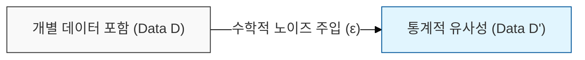
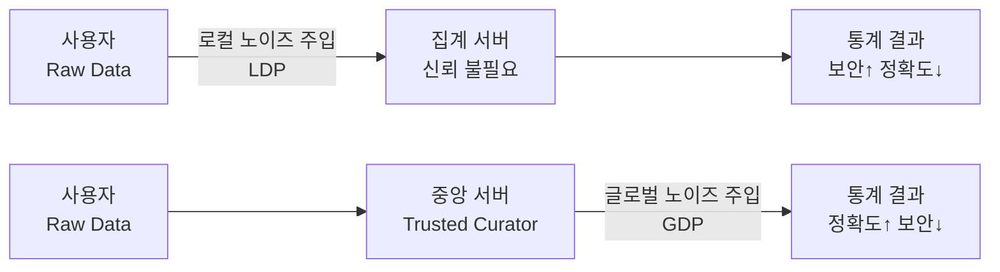

# 차분 프라이버시 (Differential Privacy)

## I. 데이터 유용성과 프라이버시의 균형, 차분 프라이버시의 개요

**정의**: 특정 데이터셋에 개별 데이터의 포함 여부와 상관없이 통계적 분석 결과가 거의 동일하게 나오도록 확률 분포에 수학적 노이즈를 주입하는 프라이버시 보호 메커니즘  

**핵심 원리 및 특징**:  
( **배경지식 공격 방어** ) 공격자가 외부 정보(배경지식)를 가지고 있더라도 특정 개인의 정보를 식별할 수 없도록 수학적으로 증명  
( **프라이버시 예산** ) `ε` (**Privacy Budget**) 값이 작을수록 개인정보 보호 수준은 강화되나 데이터의 유용성은 저하되는 트레이드오프 존재  
( **수학적 엄밀성** ) `Pr[M(D) ∈ S] ≤ e^ε × Pr[M(D') ∈ S]` 와 같은 수식을 통해 프라이버시 노출 정도를 정량적으로 제어  

---

## II. 차분 프라이버시의 주요 메커니즘 및 구성 요소

### 가. 노이즈 주입 위치에 따른 구현 모델

> **핵심:** 사용자 단말에서 노이즈를 추가하는 **로컬 방식(LDP)**과 수집된 중앙 DB에서 추가하는 **글로벌 방식(GDP)**으로 구분

---

### 나. 핵심 구성 요소 및 기술

| 구성 요소 | 상세 설명 | 비고 |
|----------|---------|------|
| Privacy Budget (ε) | 데이터 노출 허용 오차 범위. 작을수록 보안 높고 정확도 낮음 | 핵심 튜닝 파라미터 |
| Laplace Mechanism | 데이터에 라플라스 분포 기반의 노이즈를 추가하는 기법 | 수치형 데이터에 적합 |
| Sensitivity (민감도) | 하나의 레코드가 쿼리 결과에 미칠 수 있는 최대 변화량 | 노이즈 크기 결정 요인 |
| Exponential Mechanism | 비수치형(범주형) 데이터 응답 시 최적의 답을 선택하는 기법 | 범주형 데이터 적용 |

---

## III. 차분 프라이버시와 기존 k-익명성 모델 비교

| 비교 항목 | k-익명성 계열 (k-Anonymity) | 차분 프라이버시 (Differential Privacy) |
|----------|--------------------------|-------------------------------------|
| 수학적 정의 | 경험적/구조적 비식별 (값의 변환) | 엄밀한 수학적 증명 기반 (확률 분포 제어) |
| 공격 방어 | 연결 공격, 재식별 공격 방어 | 배경지식 공격(Background Attack)에 강인 |
| 데이터 형태 | 정형 데이터셋 (Micro-data) | 쿼리 응답 및 통계치 (Statistical Output) |
| 한계점 | 재식별 리스크 상존, 고차원 데이터 취약 | 노이즈 주입으로 인한 데이터 정확도 저하 |
