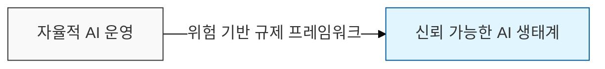

# 유럽 AI 법 (EU AI Act)

## I. 신뢰 가능한 AI를 위한 글로벌 표준, EU AI Act의 개요

**정의:** AI 시스템이 인간의 안전, 건강, 기본권을 침해하지 않도록 위험 수준별로 의무 사항을 규정한 EU의 법적 프레임워크

**특징**:  
 (**위험 기반 규제**) AI 시스템의 위험 수준에 따라 4단계로 분류하고 차등화된 의무 사항 부여  
 (**인간 중심 설계**) 인간의 안전, 건강, 기본권을 보호하기 위해 고위험 AI에 대한 엄격한 감독 요구  
 (**글로벌 표준 지향**) 유럽을 넘어 전 세계 AI 거버넌스 및 윤리적 가이드라인의 표준 모델 제시  

---

## II. 위험 기반 4단계 분류 체계 및 규제 내용

| 위험 등급 | 대상 예시 (Use Case) | 규제 및 의무 사항 |
|:---:|-------------------|-----------------|
| 1. **용납 불가** (Unacceptable) | 사회적 점수(Social Scoring), 실시간 원격 생체 인식, 인지 조작 | EU 내 출시 및 사용 전면 금지 |
| 2. **고위험** (High Risk) | 의료, 교통, 교육(채용/평가), 선거, 법 집행 시스템 | 사전 적합성 평가, 데이터 거버넌스, 로깅, 투명성 의무 |
| 3. **제한적 위험** (Limited) | 챗봇(LLM), 딥페이크, 감정 인식 시스템 | 공시 의무 (AI가 생성한 콘텐츠임을 사용자에게 고지) |
| 4. **저위험** / **최소** (Minimal) | 스팸 필터, AI 기반 게임, 단순 알고리즘 | 규제 없음 (자율적 행동 강령 권고) |

---

## III. 주요 대응 방안 및 준수 사항

| 구분 | 대응 방안 상세 | 핵심 키워드 |
|:---:|--------------|-----------|
| **거버넌스** | AI 위험 관리 시스템 구축 및 품질 관리 체계 수립 | AI Governance |
| **데이터 보호** | 학습 데이터의 편향성 제거 및 개인정보 보호 조치 강화 | Data Lineage |
| **투명성** | 알고리즘의 의사결정 과정 기록 및 설명 가능성 확보 | XAI (설명 가능한 AI) |
| **인적 감독** | 시스템 오작동 시 개입할 수 있는 인간 감독(HITL) 설계 | **HITL** (Human-in-the-Loop) |

---

## IV. EU AI Act와 기존 규제(GDPR) 비교

| 비교 항목 | GDPR (개인정보보호법) | EU AI Act (AI법) |
|----------|----------------------|-----------------|
| 주요 보호 대상 | 정보주체의 데이터(Personal Data) | 인간의 안전 및 기본권 |
| 규제 방식 | 데이터 처리 행위 규제 | AI 제품 및 서비스의 위험도 규제 |
| 적용 범위 | 개인정보 처리 시스템 전체 | 인공지능(AI) 시스템 모델 |
| 위반 시 과징금 | 전 세계 매출의 최대 4% | 전 세계 매출의 최대 7% (금지 행위 시) |
