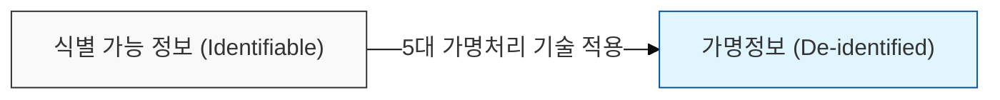
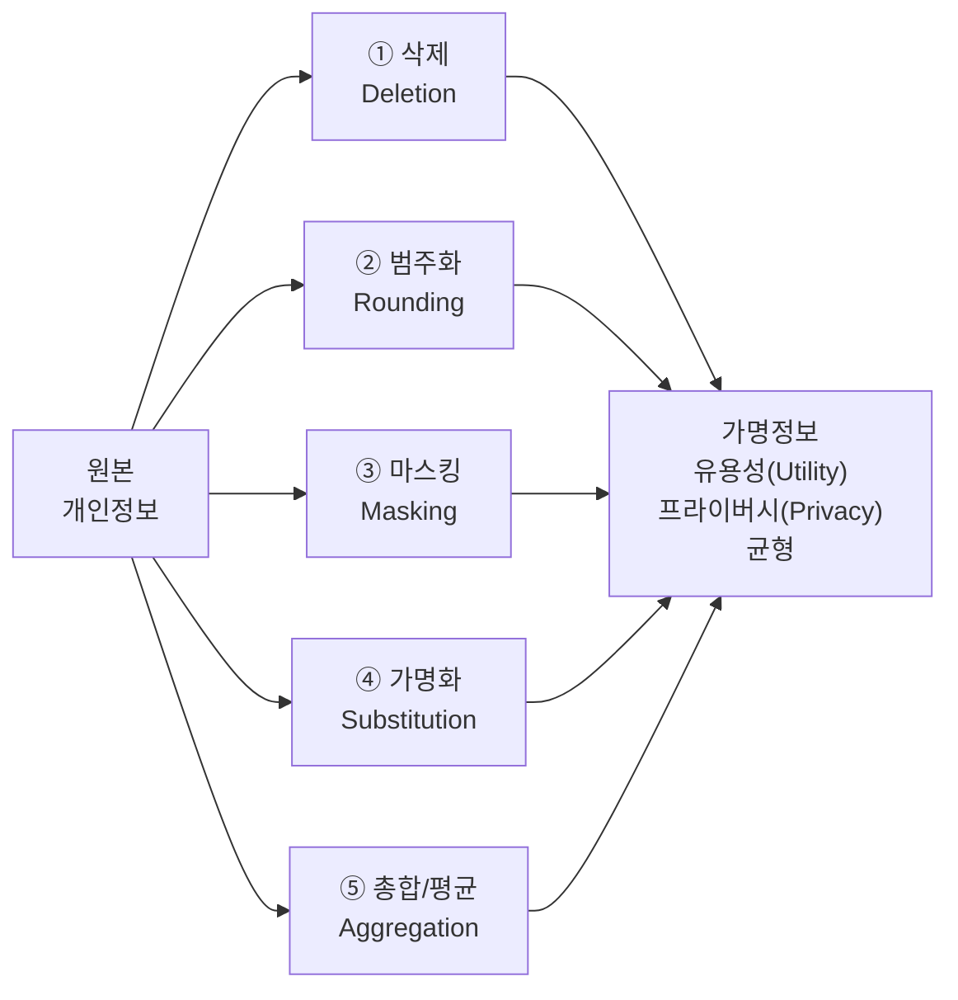

# 가명처리 기술 5가지

## I. 가명정보의 안전한 활용을 위한 가명처리 기술의 개요

**정의**: 개인정보의 일부를 삭제하거나 대체하여 추가 정보 없이는 특정 개인을 알아볼 수 없도록 처리하는 기술적 방법  

**핵심 가치 및 목적**:  
( **데이터 유용성** ) 분석 목적에 부합하도록 데이터의 통계적 속성과 품질( **Utility** ) 유지  
( **프라이버시 보호** ) 재식별 위험을 최소화하여 정보주체의 개인정보( **Privacy** ) 권리 보장  
( **리스크 관리** ) 기술적 조치를 통해 법적 준거성을 확보하고 보안 사고(재식별) 위험 원천 차단  

---

## II. 가명처리 5대 기술 및 세부 기법

| 가명처리 기술 | 상세 설명 | 구체적 예시 |
|-------------|---------|-----------|
| 1. 삭제 (Deletion) | 식별자가 포함된 항목을 직접 삭제하거나 특정 항목을 제거 | 이름, 주민번호, 전화번호 전체 삭제 |
| 2. 범주화 (Rounding) | 수치 데이터를 일정 범위(구간)로 변환하거나 반올림 처리 | 26세 → 20대, 354만원 → 300~400만원 |
| 3. 마스킹 (Masking) | 데이터의 일부를 별표(*) 등 특수기호로 대체하여 식별 방지 | 홍길동 → 홍*동, 서울시 강남구 → 서울시 **구 |
| 4. 가명화 (Substitution) | 식별자를 임의의 고유번호나 가상 번호로 대체 | 주민번호 → 일련번호(A-001)로 치환 |
| 5. 총합/평균 (Aggregation) | 개별 데이터가 아닌 집단(그룹)의 합계나 평균값으로 처리 | 개별 소득 → 부서별 평균 소득으로 변환 |

---

## III. 가명처리 기술 적용 시 고려사항 (재식별 방지)

가명처리 기술은 단독으로 사용되기보다 데이터의 특성에 따라 혼합하여 사용되며, 이때 다음과 같은 프라이버시 보호 모델을 비교하여 적용합니다.

| 비교 항목 | k-익명성 (k-Anonymity) | l-다양성 (l-Diversity) | t-근접성 (t-Closeness) |
|----------|----------------------|----------------------|----------------------|
| 핵심 개념 | 같은 속성을 가진 레코드를 k개 이상 유지 | k개 그룹 내에 l개 이상의 서로 다른 민감정보 존재 | 전체 데이터의 속성 분포와 특정 그룹의 분포 차이 최소화 |
| 방어 위협 | 연결 공격 (Linking Attack) | 동질성 공격, 배경지식 공격 | 쏠림 공격, 유사성 공격 |
| 한계점 | 동질성 공격에 취약 | 데이터 유용성 저하 가능성 | 구현의 복잡성 및 높은 비용 |
