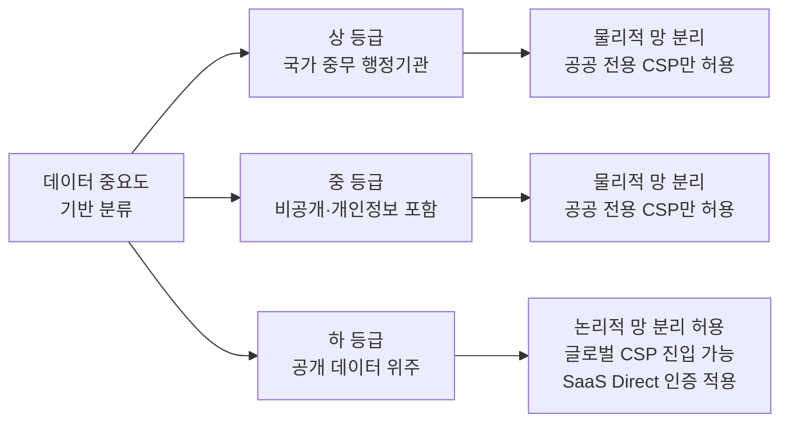

# CSAP 등급제 개편 및 공공기관 도입 요건

## I. 클라우드 보안인증( **CSAP** ) 등급제 개편의 개요

**정의**: 공공기관이 도입하려는 클라우드 서비스의 데이터 중요도에 따라 보안인증 기준을 "**상·중·하**" 3단계로 차등화하여 적용하는 클라우드 보안인증( **CSAP** ) 제도  

**개편 배경**:  
( **시장 개방** ) '하' 등급에 대한 논리적 망 분리 허용으로 글로벌 **CSP** 및 혁신 **SaaS**의 공공 시장 진입 장벽 완화  
( **전환 가속** ) 공공 부문의 클라우드 네이티브 전환을 촉진하기 위한 민간 클라우드 활용 범위 확대  
( **유연성 확보** ) 획일적 보안 기준에서 탈피하여 데이터 성격에 맞는 최적의 보안 통제 항목 적용 및 관리 효율성 제고  

---

## II. CSAP 등급제별 분류 체계 및 인증 요건

### 가. 데이터 중요도에 따른 3단계 등급 체계

> **핵심:** 국가 중추 망(상)부터 민감정보 포함(중), 공개 데이터 위주(하)로 등급을 분류함

---

### 나. 등급별 세부 인증 기준 및 도입 요건

| 등급 | 적용 대상 (데이터 중요도) | 핵심 보안 요건 | 물리적 분리 요건 |
|:----:|------------------------|--------------|:-------------:|
| 상 | 외교·안보, 수사·재판 등 국가 중무 행정기관 | 최상위 보안 수준, AI/빅데이터 등 고성능 필요 서비스 | 물리적 망 분리 유지 (공공 전용) |
| 중 | 비공개 협의 데이터, 개인정보 포함 서비스 (기존 CSAP 수준) | 민감정보 보호, 취약점 점검, 사고 대응 체계 | 물리적 망 분리 유지 (공공 전용) |
| 하 | 개인정보 미포함, 공개 데이터를 다루는 공공 서비스 | 시중 범용 서비스(SaaS/IaaS) 허용, 실증 중심 보안 | 논리적 망 분리 허용 (글로벌 CSP 진입) |

---

## III. 공공기관의 클라우드 도입 요건 및 고려사항

- **시스템 등급 선정:** 공공기관은 자체 서비스의 중요도를 평가하여 "가이드라인"에 따라 적정 등급의 CSP를 선택해야 함
- **SaaS Direct 인증:** '하' 등급에 한해 간소화된 인증 절차를 적용하여 혁신적인 민간 소프트웨어의 공공 진입 장벽 완화
- **사후 관리 강화:** 등급제 완화에 따른 보안 우려를 해소하기 위해 지속적 모니터링 및 실제 데이터 기반 점검 체계로 전환 필요
