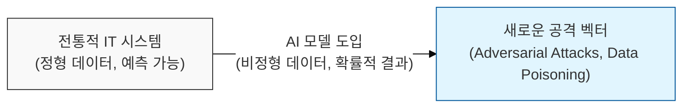
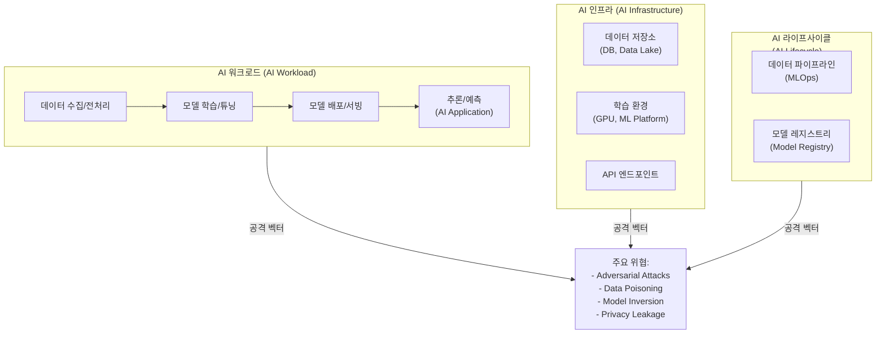

# AI 시스템 보호의 새로운 과제, AI 시스템 보안

## I. 전통적 보안을 넘어선 AI 특화 위협, AI 시스템 보안의 개요

**정의:** 인공지능( **AI** ) 모델 및 이를 포함하는 시스템 전반의 기밀성, 무결성, 가용성( **CIA** )을 보장하기 위한 보안 체계 및 기술  

**핵심 특징 및 필요성**:  
( **새로운 공격 벡터** ) 기존 IT 보안으로는 방어하기 어려운 적대적 공격( **Adversarial Attacks** ), 데이터 오염( **Data Poisoning** ) 등 AI 특화 위협 존재  
( **데이터 프라이버시** ) 민감한 학습 데이터의 유출 및 재식별 위험에 대한 강력한 보호 조치 필요  
( **모델 무결성** ) AI 모델 자체의 무결성을 손상시키거나 편향성을 유발하여 오작동을 일으키는 공격 방지  
( **복잡한 시스템** ) 데이터 수집, 전처리, 모델 학습, 배포, 추론 등 AI 라이프사이클 전반에 걸친 보안 고려사항 발생  

---

## II. AI 시스템 보안의 주요 위협 및 공격 메커니즘

### 가. AI 시스템의 공격 표면 (Attack Surface)

### 나. 주요 AI 특화 공격 유형

| 공격 유형 | 상세 설명 | 위협 내용 |
|:---:|----------|----------|
| **적대적 공격 (Adversarial Attacks)** | 모델의 오작동을 유발하기 위해 입력 데이터에 미세한 노이즈 추가 | - **회피 공격 (Evasion):** 학습된 모델의 정상 분류를 오작동시킴 (예: 악성코드 탐지 우회)  - **교란 공격 (Perturbation):** 미세한 변화로 분류 결과 왜곡 (예: 이미지 분류 오류 유발) |
| **데이터 오염 (Data Poisoning)** | 모델 학습 데이터에 악성 데이터를 주입하여 모델의 성능 저하 또는 특정 결과 유도 | - **백도어 생성:** 특정 입력에 대해 의도된 오작동 유발  - **성능 저하:** 모델의 전반적인 정확도 하락 |
| **모델 역공학 (Model Inversion / Extraction)** | 학습된 모델의 구조나 학습 데이터를 추론하거나 탈취 | - **학습 데이터 프라이버시 침해:** 민감한 개인정보 유출 위험  - **모델 구조 탈취:** 경쟁사의 기술 유출 또는 추가 공격에 활용 |
| **프라이버시 침해** | 모델이 학습한 데이터에서 개인 정보 유출 | **Membership Inference Attack** 등 |

---

## III. AI 시스템 보안 강화 방안

### 가. 안전한 AI 개발 및 운영 (Securing AI Lifecycle)

- **데이터 보안:** 학습 데이터의 무결성 검증, 프라이버시 보호 조치( **가명처리**, **차분 프라이버시** ) 적용
- **모델 보안:** 적대적 공격 방어 기법( **Adversarial Training** ), 모델 무결성 검증( **Model Integrity Check** )
- **API 보안:** LLM 등 AI 서비스 API에 대한 접근 제어, **Rate Limiting**, 입력/출력 검증( **Input/Output Validation** )
- **지속적인 모니터링:** AI 시스템의 운영 로그 및 모델 성능 이상 징후 감시

### 나. AI 보안의 새로운 패러다임

- **AI for Security:** AI 기술을 활용하여 보안 위협 탐지 및 대응 역량 강화 ( **UEBA**, **Anomaly Detection** )
- **Security for AI:** AI 시스템 자체의 보안 취약점을 분석하고 이를 방어하는 기술 개발

> **핵심:** AI 시스템 보안은 전통적인 IT 보안과는 다른 새로운 접근 방식이 필요하며, 데이터, 모델, 인프라 전반에 걸친 **다층적 방어**가 필수적임
