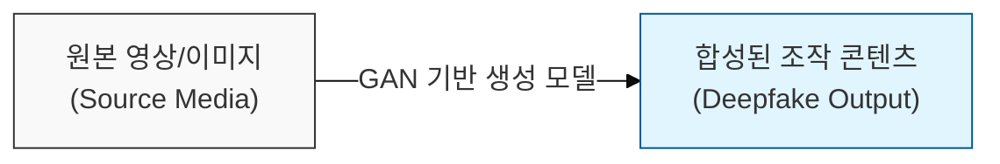
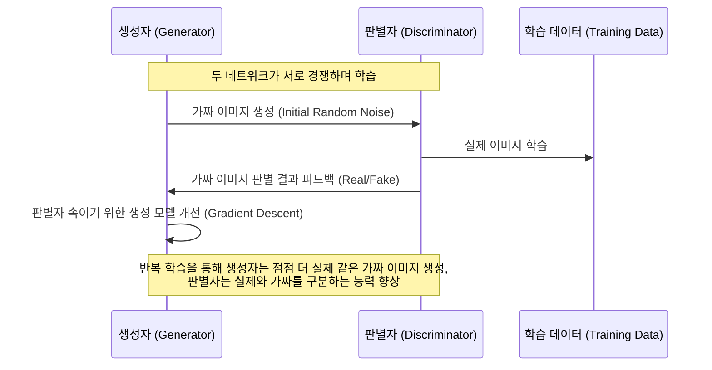

# 현실을 왜곡하는 AI, 딥페이크 (Deepfake)

## I. AI 기반의 가짜 콘텐츠, 딥페이크의 개요

**정의:** 딥러닝(Deep Learning), 특히 **GAN**(Generative Adversarial Networks) 기술을 활용하여 특정 인물의 얼굴이나 목소리를 합성·편집한 사실적인 가짜 영상 또는 음성 콘텐츠  

**핵심 특징 및 보안 위협**:  
( **현실적 조작** ) 기존 이미지/영상 편집 기술로는 구현하기 어려운 높은 사실성으로 진위 판별 어려움  
( **악의적 활용** ) 가짜 뉴스 유포, 명예 훼손, 금융 사기( **보이스피싱** ), 정치적 선동 등 사회적 혼란 야기 가능성 증대  
( **신원 도용** ) 특정 인물의 목소리나 얼굴을 무단으로 도용하여 사칭 범죄에 악용될 우려  

---

## II. 딥페이크 생성 원리 및 기술적 메커니즘

### 가. GAN (Generative Adversarial Networks) 기반 생성 모델

### 나. 딥페이크 생성 과정 상세

1.  **데이터 수집:** 대상 인물의 얼굴, 표정, 목소리 등 대량의 원본 데이터 수집 ( **AI** 모델 학습용)
2.  **모델 학습:** **GAN**을 이용하여 원본 데이터의 특징을 학습하고, 새로운 얼굴/음성 합성 생성 모델 훈련
3.  **콘텐츠 생성:** 학습된 모델에 입력값(타겟 얼굴/목소리)을 주입하여 조작된 딥페이크 영상 또는 음성 생성
4.  **후처리 (Optional):** 생성된 콘텐츠의 자연스러움을 높이기 위한 편집 및 합성 작업

---

## III. 딥페이크 탐지 및 대응 전략

### 가. 딥페이크 탐지 기술

- **AI 기반 분석:** 생성된 콘텐츠의 미묘한 시각적/청각적 불일치(얼굴 깜빡임, 표정 부자연스러움, 음성 변조 흔적 등)를 AI 모델로 탐지
- **워터마킹 (Watermarking):** 콘텐츠 제작 시 원본 데이터에 보이지 않는 식별 정보를 삽입하여 진위 여부 검증
- **디지털 주권 (Digital Provenance):** 콘텐츠의 생성, 편집, 유통 과정을 기록하고 추적할 수 있는 기술 도입 ( **Blockchain** 등 활용)

### 나. 법적·제도적 대응 방안

- **악용 방지 법률 강화:** 딥페이크를 이용한 명예훼손, 음란물 제작·유포, 선거 개입 등에 대한 처벌 규정 강화
- **플랫폼 책임 강화:** 소셜 미디어 등 콘텐츠 유통 플랫폼에 대한 딥페이크 탐지 및 유통 차단 의무 부과
- **보안 인식 제고:** 딥페이크의 위험성과 식별 방법에 대한 대중 교육 및 홍보 강화

> **핵심:** 딥페이크는 기술 발전과 함께 더욱 정교해지므로, **AI 기반 탐지 기술**과 **법적·제도적 규제**를 병행하여 대응해야 함
