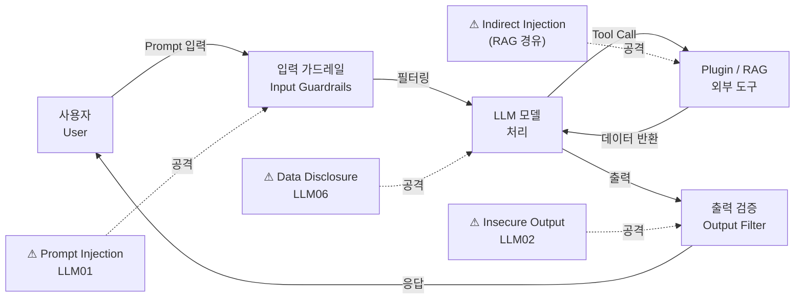

# LLM 보안 (OWASP Top 10 for LLM)

## I. 생성형 AI 시대의 새로운 보안 위협, LLM 보안의 개요

**정의:** LLM(대규모 언어 모델) 애플리케이션을 대상으로 하는 데이터 유출, 프롬프트 주입 등 10대 주요 보안 취약점 및 대응 체계

**특징:** 기존 웹 보안(OWASP Top 10)과 달리 비결정적 출력, 프롬프트 기반 공격 등 모델 고유의 특성에 기반한 위협 존재

---

## II. LLM 보안 위협 아키텍처 및 주요 취약점 항목

### 가. LLM 애플리케이션 위협 모델링 (Threat Modeling)

> **핵심:** 사용자 입력(Prompt)부터 모델 처리, 외부 도구(Plugin/RAG) 연동 전 과정이 공격 접점임

---

### 나. OWASP Top 10 for LLM 주요 항목 및 대응 방안

| 순위 | 핵심 항목 | 상세 설명 및 대응 방안 |
|------|----------|----------------------|
| LLM 01 | Prompt Injection | 조작된 입력으로 모델의 가드레일을 우회하거나 악의적 명령 수행 (Direct/Indirect) |
| LLM 02 | Insecure Output Handling | 모델 출력을 검증 없이 실행하여 XSS, SSRF 등 2차 공격 유도 (출력 필터링 필수) |
| LLM 06 | Sensitive Data Disclosure | 학습 데이터나 RAG를 통해 민감 정보가 유출되는 현상 (데이터 비식별화, PII 필터링) |
| 기타 | Training Data Poisoning | 학습 데이터에 악성 데이터를 주입하여 모델의 편향성이나 백도어 유발 |

---

## III. 안전한 LLM 서비스 구축을 위한 보안 전략

- **인간 중심 검증(HITL):** LLM의 출력을 신뢰하기 전 인간의 검토 단계를 포함하여 신뢰성 확보
- **LLM 가드레일(Guardrails) 적용:** 입력과 출력 단계에서 NeMo-Guardrails 등 보안 솔루션을 통한 실시간 필터링 체계 구축
