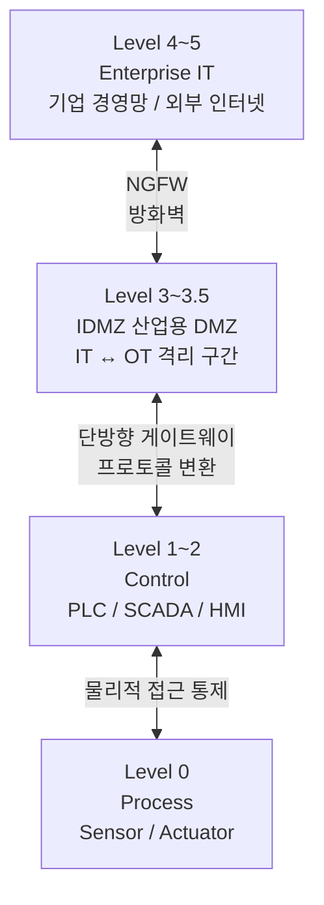

# OT/ICS 보안 및 Purdue 모델

## I. 산업 현장의 생존 보안, OT/ICS 보안의 개요

**정의:** 제조, 에너지 등 산업 공정을 제어하는 운영 기술(OT) 및 산업 제어 시스템(ICS)을 사이버 위협으로부터 보호하는 체계

**특징:** IT 보안이 기밀성(C)을 중시하는 반면, OT 보안은 24시간 중단 없는 운영인 **가용성(A)**과 인명/설비 안전을 최우선함

---

## II. 계층적 방어 체계, Purdue 모델 및 주요 보안 요소

### 가. Purdue 모델 기반의 OT/ICS 네트워크 구조

> **핵심:** 레벨 0(현장 장치)부터 레벨 5(기업망)까지 계층을 분리하고, **IDMZ(산업용 DMZ)**를 통해 IT와 OT 구간을 격리함

---

### 나. 계층별 구성 요소 및 보안 대응 방안

| 계층 (Level) | 명칭 및 구성 요소 | 주요 보안 대응 방안 |
|:-----------:|----------------|------------------|
| Level 4~5 | Enterprise (IT) | 기업 경영망, 외부 연결 구간으로 차세대 방화벽(NGFW) 적용 |
| Level 3~3.5 | Site Operations (IDMZ) | 중간 완충 지대, 패치 관리 서버, 데이터 복제, 인증 강화 |
| Level 1~2 | Control (PLC, SCADA) | 제어 루프 구간, 화이트리스트 기반 침입 탐지, 프로토콜 검사 |
| Level 0 | Process (Sensor/Actuator) | 현장 물리 장치, 물리적 접근 통제 및 설비 이상 징후 모니터링 |

---

## III. OT/ICS 보안 강화를 위한 향후 과제

- **프로토콜 가시성 확보:** Modbus, S7, EtherNet/IP 등 제조사별 전용 프로토콜에 대한 심층 패킷 분석(DPI) 필수
- **에어갭(Air-gap)의 한계 극복:** 폐쇄망이라도 USB나 유지보수 단말을 통해 침투하므로, 제로 트러스트 기반의 단말 인증 도입 필요
- **글로벌 표준 준수:** 산업 제어 시스템 보안 국제 표준인 IEC 62443 인증 획득을 통한 보안 거버넌스 수립
