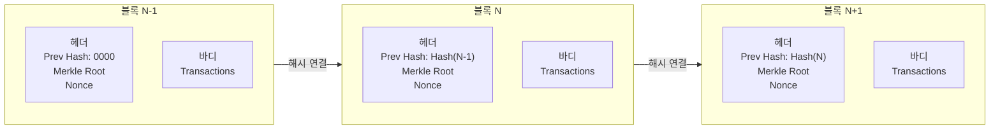

# 신뢰의 분산 네트워크, 블록체인

## I. 중앙 집중형의 한계를 극복하는 분산 원장, 블록체인의 개요

**정의**: 모든 네트워크 참여자가 거래 장부를 공유하고 대조함으로써 데이터의 투명성과 무결성을 보장하는 분산 원장 기술  

**핵심 특징 및 보안 가치**:  
( **탈중앙성** ) 중앙 관리자 없이 **P2P** 네트워크를 통해 거래가 직접 이루어지며 가용성( **No SPoF** ) 확보  
( **무결성** ) 해시 함수를 이용한 블록 체이닝과 머클 루트( **Merkle Root** )를 통해 데이터 위변조 방지  
( **가시성** ) 모든 참여자에게 장부가 공개되어 거래의 투명성과 추적성( **Traceability** )을 극대화  
( **비가역성** ) 한번 기록된 정보는 분산 합의 없이는 수정이나 삭제가 불가능하여 사후 증거력 확보  

---

## II. 블록체인의 핵심 구성 요소 및 연결 구조

### 가. 블록의 구조 및 체이닝 메커니즘

- **블록 헤더(Block Header):** 이전 블록의 해시값(Previous Hash), 머클 루트(Merkle Root), 논스(Nonce) 포함 → 블록 간 연결성 유지
- **블록 바디(Block Body):** 실제 거래 내역(Transactions)들의 집합
- **머클 루트(Merkle Root):** 개별 거래들을 해시 트리 형태로 요약 → 데이터 변조 여부 빠르게 검증

---

### 나. 블록체인 운영의 4대 핵심 기술

| 기술 요소 | 상세 설명 | 보안적 가치 |
|----------|---------|-----------|
| P2P 네트워크 | 중앙 서버 없이 단말 간 직접 통신 | 가용성 (No SPoF) 확보 |
| 합의 알고리즘 | 분산 노드 간 데이터 일치 여부 결정 (PoW, PoS 등) | 데이터 정합성 보장 |
| 해시 함수 | 이전 블록의 정보를 암호화하여 연결 | 무결성 (위변조 방지) |
| 스마트 계약 | 특정 조건 만족 시 자동 실행되는 프로그램 코드 | 거래의 신뢰성 및 자동화 |

---

## III. 블록체인의 분류 및 비교

| 구분 | 퍼블릭 (Public) | 프라이빗 (Private) | 컨소시엄 (Consortium) |
|------|--------------|-----------------|---------------------|
| 참여 제한 | 누구나 참여 가능 | 허가된 조직/개인만 | 미리 정해진 기관들 |
| 중앙 집중도 | 완전 분산형 | 중앙 집중형 | 부분 분산형 |
| 처리 속도 | 느림 (합의 비용 발생) | 매우 빠름 | 빠름 |
| 인센티브 | 암호화폐 (보상) 필수 | 불필요 | 선택적 |
| 사례 | 비트코인, 이더리움 | 기업 내 공급망 관리 | 금융권 공동망 (R3CEV) |
