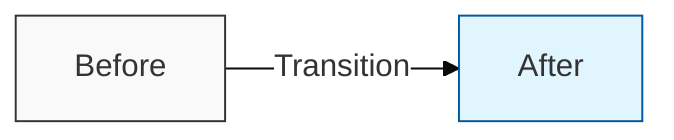

# 프로젝트 콘텐츠 작성 규칙

## 1. 볼드체(`**`) 작성 규칙
`marked.js` 파싱 오류를 방지하기 위해 다음을 반드시 준수합니다.
- **특수문자 분리**: `(`, `)`, `/`, `:`, `·` 등의 기호와 숫자는 볼드 태그(`**`) 밖에 둡니다.
  - ❌ 잘못된 예: `**정의:**`, `**1. 개요**`, `**노이즈(Noise)**`
  - ✅ 올바른 예: `**정의**:` , `1. **개요**`, `**노이즈**(Noise)`
- **따옴표 위치**: 따옴표(`"`, `'`)는 반드시 볼드 태그 밖에 둡니다.
  - ❌ 잘못된 예: `**"기밀성"**`
  - ✅ 올바른 예: `"**기밀성**"`

## 2. 1단락 '통찰 도식' 작성 규칙 (Mermaid Insight Diagram)
1단락 제목(## I. ...) 바로 다음에 해당 주제를 직관적으로 통찰할 수 있는 도식을 추가합니다.
- **형식**: `A["이전 상태"] -- "전환 가치" --> B["이후 상태"]`
- **배경색 설정**: 중간 문구의 가독성을 위해 `#fff` 배경을 적용합니다.
- **노드 스타일**: A(회색), B(파란색), 테두리 두께(1px)를 엄격히 준수합니다.
- **템플릿**:

## 3. 1단락 '특징 / 필요성' 작성 규칙 (개조식)
1단락의 특징(또는 필요성, 핵심 가치) 섹션은 다음 형식을 엄격히 준수합니다.
- **불렛 제거**: `-` 나 `*` 같은 불렛 기호를 사용하지 않습니다.
- **괄호 키워드**: `( **키워드** ) 내용` 형식을 사용합니다.
- **줄바꿈 보장**: 섹션 제목(`**특징**:` 등)과 각 행의 끝에 **공백 두 개**를 추가하여 Markdown 줄바꿈을 강제합니다.  

## 4. Mermaid 일반 다이어그램 규칙
- 모든 노드 라벨과 화살표 텍스트는 반드시 쌍따옴표(`""`)로 감쌉니다.

## 5. MDX 및 수식 처리
- Docusaurus/MDX 환경에서 중괄호(`{}`)가 포함된 수식은 자바스크립트 변수로 오인될 수 있습니다.
- `$ ... $` 기호 대신 백틱(`` `...` ``)을 사용하여 수식을 표현합니다.

## 6. 제목 및 파일 구조
- **제목**: "주목도를 높이는 문구, 핵심 용어" 형식을 권장합니다.
- **Frontmatter**: Docusaurus 형식의 `title`, `sidebar_label`, `sidebar_position`을 포함합니다.
